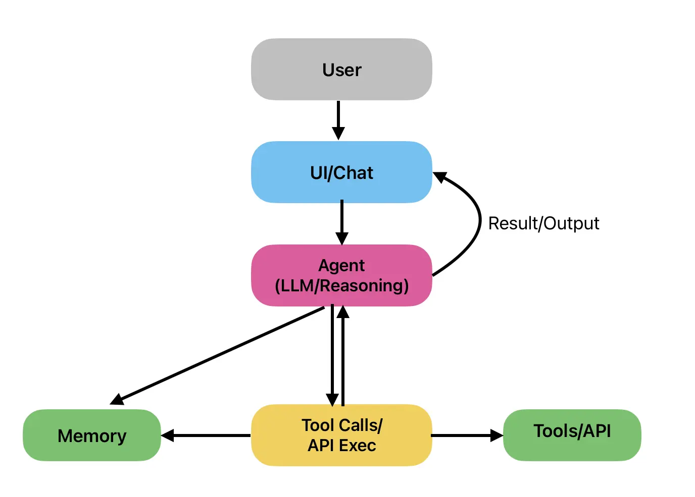
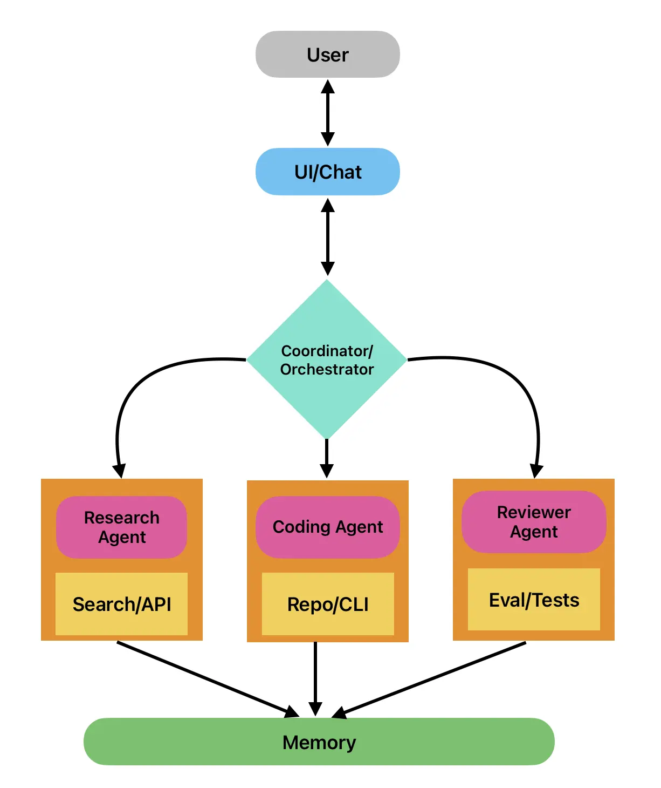

* Table of Contents
{:toc}
---
Imagine having a personal assistant who never sleeps, learns on the fly, and can book your flights, summarize your emails, debug your code, and even negotiate deals—without you lifting a finger. That’s not science fiction anymore. Welcome to the world of **AI agents**.

AI agents are more than just chatbots. They’re autonomous systems powered by large language models (LLMs) that can **reason, plan, and take action** using a variety of tools. Unlike traditional software that follows fixed rules, AI agents can adapt to new situations, make decisions in real time, and collaborate with other agents to tackle complex tasks.

In this blog, we’ll break down:
- The evolution of AI Agents
- Anatomy of those systems
- Types of AI Agents
- Challenges and limitations you should know

---

## Why Now?

The concept of autonomous agents has been around for decades, but it’s only in the last 2–3 years that they’ve become truly practical. This sudden leap is the result of several converging trends:

- **Powerful Language Models**: The arrival of GPT-4, Claude, Gemini, and other advanced LLMs has given agents the ability to reason, understand context, and generate human-like responses at scale.
- **Tool Integration Frameworks**: Frameworks like LangChain, Semantic Kernel, and CrewAI make it easy for agents to use external tools—APIs, search engines, databases, code execution environments—on demand.
- **Cheaper & Faster Compute**: Cloud providers now offer more affordable, faster GPUs, reducing the barrier to running continuous, high-capacity agent workflows.
- **Multi-Agent Coordination**: Orchestration platforms allow multiple agents to collaborate on complex tasks, dividing work just like human teams do.
- **Explosion of Open-Source Projects**: Open-source tools like Auto-GPT, BabyAGI, and CAMEL have lowered the barrier for developers and hobbyists to experiment with autonomous AI.

This combination of **brains (LLMs)**, **hands (tools & APIs)**, and **infrastructure (compute & orchestration)** has pushed AI agents from research prototypes into usable, real-world systems.

Let’s dive in.

--- 

## The Evolution of AI Agents

➡️ **1980s–2000s: Rule-Based Systems**  
Expert systems with if–then–else rules. Narrow but rigid.  
*Example: ELIZA, early IVR menus.*  

➡️ **2010–2018: Task-Specific Bots**  
NLP let bots understand intent. Handy for FAQs & reminders, but still brittle.  
*Example: Siri, Alexa (early versions).*  

➡️ **2019–2022: LLM-Powered Agents**  
GPT-3 brought contextual reasoning & coherent text. Great at conversation, but passive.  
*Example: ChatGPT in early workflows.*  

➡️ **2023–Present: Autonomous Agents**  
Agents now plan tasks, call APIs, execute code, and self-correct.  
*Examples: Auto-GPT, BabyAGI, LangChain, Semantic Kernel.*  

➡️ **Emerging: Multi-Agent Systems**  
Teams of agents working like humans — delegating, negotiating, collaborating.  
*Examples: Experimental distributed dev & research agents.*  

**In short:** We’ve gone from brittle, rule-based bots to adaptive, tool-using digital teammates that can coordinate with each other. Each leap has been driven by advances in **language understanding, reasoning, and integration with the digital world**—and the next leap may be agents that learn and evolve continuously without retraining.

---

## Anatomy of an AI Agent

At their core, AI agents combine **intelligence** (reasoning and decision-making) with **capability** (the ability to act in the world). While implementations vary, most modern AI agents share a common set of building blocks:

Here is a diagram showing the backbone of a single AI Agent system

### 1. **Reasoning Engine (Brain)**
- **Purpose**: Processes user goals, breaks them into steps, and decides the best course of action.
- **Typical Tech**: Large Language Models (LLMs) like GPT-4, Claude, or Gemini.
- **Example**: Given “Find the latest stock prices and summarize trends,” the reasoning engine decides to:
  1. Call a financial API.
  2. Analyze the data.
  3. Generate a summary in plain English.

### 2. **Memory**
- **Short-Term Memory**: Keeps track of context within an ongoing interaction (like the current conversation thread).
- **Long-Term Memory**: Stores past interactions, facts, or preferences for retrieval later.
- **Implementation**: Vector databases (Pinecone, Weaviate, FAISS) for semantic search.
- **Benefit**: Enables personalization and continuity across multiple sessions.

### 3. **Tools & Actions (Hands)**
- **Purpose**: Let the agent interact with the outside world beyond generating text.
- **Examples**:
  - Web search
  - API calls
  - Code execution
  - Database queries
  - File creation and editing
- **Framework Role**: LangChain, Semantic Kernel, and similar frameworks define these tool interfaces.

### 4. **Orchestrator (Planning and Control) **
- **Planner**: Breaks a complex task into smaller subtasks and sequences them logically.
- **Controller**: Executes steps, monitors outcomes, and adapts if something goes wrong.
- **Example**: If a web search fails, the agent retries with a different query or switches data sources.

### 5. **Feedback Loop (Self-Reflection)**
- **Purpose**: Evaluates outputs and decides whether to refine them before returning results.
- **Techniques**:
  - Chain-of-thought reasoning
  - Self-critique prompts
  - Peer review in multi-agent setups
- **Benefit**: Improves reliability and reduces hallucinations.

### 6. **Interface (Face)**
- **What Users See**: The medium through which humans interact with the agent.
- **Forms**:
  - Chat interfaces
  - Voice assistants
  - API endpoints
  - Embedded widgets in apps

This modular design means developers can **swap components**—using a different LLM, adding new tools, or expanding memory—without rewriting the entire system.

Using all the above components, we now have a diagram for multiple AI Agents in a system. 

### Types of AI Agents

Not all AI agents are created equal. Depending on their **scope**, **level of autonomy**, and **domain focus**, agents can take many forms. Here are the main categories you’ll encounter. 

| Type | Description | Strengths | Weaknesses | Examples |
|------|-------------|-----------|------------|----------|
| **Single-Task Agents** | Designed for one specific job or workflow. | Simple to build, fast to deploy, highly reliable within scope. | Useless outside their predefined task. | - Customer support bot handling refunds - Email summarizer for daily digests |
| **Multi-Task Agents** | Can perform a variety of tasks within a general domain. | Versatile, can handle related requests without retraining. | Less specialized, may underperform on niche tasks. | - Personal productivity assistant (schedule meetings, draft emails) - Office AI for reports, data viz, Q&A |
| **Autonomous Agents** | Given a goal, they plan and execute without step-by-step human input. | Operate for long periods, adapt mid-process, handle unexpected scenarios. | Harder to control, higher risk of unintended behavior. | - Auto-GPT-style research bots - Automated trading bots |
| **Multi-Agent Systems** | Networks of agents with specific roles collaborating towards a goal. | Scalable via specialization, built-in error-checking through collaboration. | Complex coordination, risk of communication breakdown. | - Software factory (coding, testing, deploying) - Research teams (analysis, summarization, drafting) |
| **Domain-Specific Agents** | Optimized for a narrow vertical or industry, fine-tuned on specialized data. | Deep expertise in their domain. | Limited transferability to other contexts. | - Healthcare diagnosis agents - Legal document review bots |

---

## Challenges & Limitations of AI Agents

AI agents may be powerful, but they’re far from perfect. Understanding their limitations helps set realistic expectations and design safer, more reliable systems.

| Challenge | Why It Happens | Impact | Mitigation |
|-----------|----------------|--------|------------|
| **Hallucinations & Inaccuracy** | LLMs generate words probabilistically, not based on truth. | Wrong answers → misinformation, wasted effort. | Fact-checking layers, Retrieval-Augmented Generation (RAG). |
| **Reliability in Long Tasks** | Tool errors, inconsistent reasoning, goal drift. | Agents stall, loop, or fail mid-process. | Watchdog processes, timeouts, checkpointing. |
| **Security & Privacy Risks** | Weak permissions, poor prompt design, unsafe inputs. | Sensitive data leaks, unsafe actions. | Strict tool access, input/output sanitization, avoid externalizing sensitive data. |
| **Cost & Resource Usage** | Long contexts, excessive LLM/API calls, multi-agent chatter. | High bills, inefficient compute usage. | Prompt optimization, caching, usage monitoring & budgeting. |
| **Evaluation & Benchmarking** | Success often subjective, creative, or multi-dimensional. | Hard to measure quality or progress. | Define clear KPIs, human-in-the-loop evaluation. |
| **Ethical & Alignment Concerns** | Misaligned goals, vague prompts, loopholes. | Unintended or harmful behaviors. | Safety filters, guardrails, limit autonomy in high-stakes areas. |

In multi-agentic AI systems, it is essential for knowing the right steps where "human in the loop" is required, having robust security/authentication mechanisms to ensure that the agents do not carry out destructive processes and the orchestration ensuring that the correct agent is invoked. 

---

## Bottom Line
While AI agents can unlock huge productivity gains, they require **careful design, monitoring, and control mechanisms** to be both safe and effective. Treat them as **powerful assistants**—not infallible decision-makers.

The upcoming article (soon to be linked here) will discuss about how Microsoft products adopt and encourage building Agentic AI systems, along with other open source tools. 

---