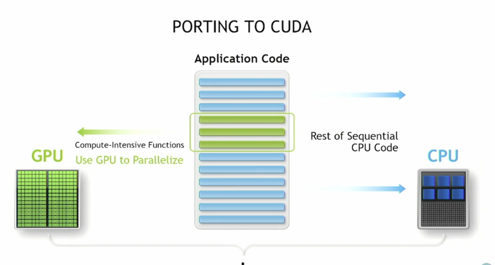
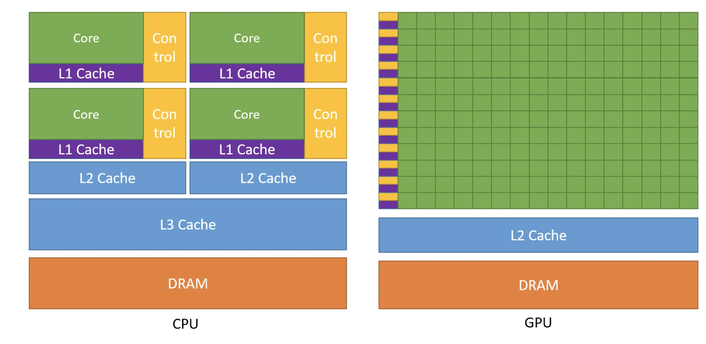
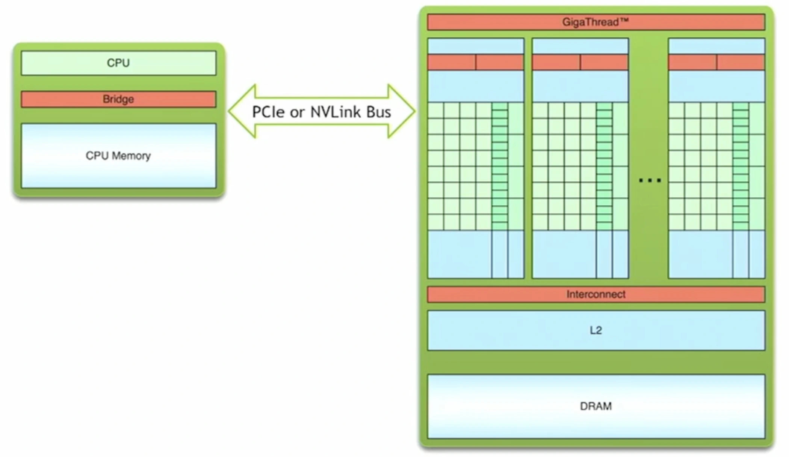
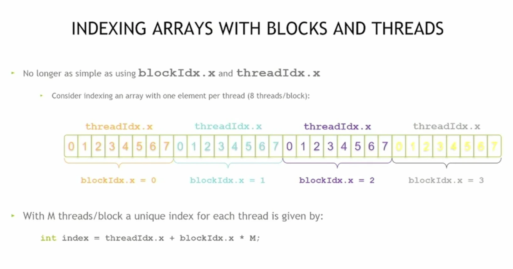

<script type="module">
  import mermaid from 'https://cdn.jsdelivr.net/npm/mermaid@10/dist/mermaid.esm.min.mjs';
  mermaid.initialize({ startOnLoad: true, theme: 'neutral' });
</script>

* Table of Contents
{:toc}

---

CUDA stands for **Compute Unified Device Architecture**. It is NVIDIA’s parallel computing platform and programming model that enables developers to harness the power of Graphics Processing Units (GPUs) not just for rendering graphics, but also for **general-purpose computing tasks**.  

At its core, CUDA provides a **programming-first model** with C/C++ as the primary language binding. Beyond C/C++, developers can also use CUDA through **Fortran, Python, and MATLAB bindings**, making it accessible across domains.  

A key idea behind CUDA programming is the concept of **heterogeneous computing**—where CPUs (the host) and GPUs (the device) work together. The CPU manages and schedules tasks, while the GPU executes them in massively parallel fashion. We’ll explore this idea in more detail below.  

---

# Heterogeneous Computing  


In CUDA programming, computation is divided between two main components:  

- **Host** → the CPU and its memory  
- **Device** → the GPU and its memory  




Each is optimized for a different role. The **host** manages tasks such as scheduling, control flow, and lighter operations (e.g., I/O, networking). The **device**, on the other hand, excels at **heavy computations** that can benefit from massive parallelism.  



The key idea is to **offload compute-intensive workloads** from the CPU to the GPU, while letting the CPU handle orchestration and tasks that don’t require parallel execution.  


---
# Simple Processing Flow  

A typical CUDA program follows three main steps:  

1. **Copy input data** from CPU (host) memory to GPU (device) memory.  
2. **Execute the kernel** on the GPU — this is where the heavy lifting happens, with data loaded onto the GPU’s fast on-chip memory for maximum performance.  
3. **Copy the results back** from GPU memory to CPU memory for further use or output.  




This flow illustrates the core idea of **heterogeneous computing**: the CPU manages orchestration, while the GPU accelerates data-parallel workloads.  

---

# Components of a CUDA Program  

To write a CUDA program, you need to understand a few **special components** that make GPU programming different from regular C/C++.  


## Marking functions to run on GPU 

By default, functions in C/C++ run on the **host (CPU)**. To make a function run on the **device (GPU)**, CUDA introduces special keywords.  

- `__global__` → Defines a **kernel function**:  
  1. It runs **on the GPU (device)**.  
  2. It is called **from the CPU (host)**.  

Example:  

```cpp
__global__ void helloGPU() {
    printf("Hello from GPU thread %d\n", threadIdx.x);
}
```

As you can see, without `__global__`, the function would run on the CPU only, but with this keyword, it can run on the GPU instead, if called with kernel launch configuration (explained below). 

## Compilation of Code  

CUDA programs are compiled using the **NVIDIA CUDA Compiler (`nvcc`)**:  

- **`nvcc`** → The compiler driver that separates host and device code.  
- Host code → compiled by a regular C++ compiler.  
- Device code (kernels) → compiled by NVIDIA’s compiler into GPU instructions (**PTX → SASS**).  

This separation is what allows a single `.cu` file to contain both CPU and GPU code.  

Link to learning more about NVCC: [NVCC Compiler](https://docs.nvidia.com/cuda/cuda-compiler-driver-nvcc/)

## Kernel Launch Configuration  

Calling a GPU kernel requires **launch configuration parameters**, which specify how many threads and blocks to use:  

```cpp
myKernel<<<numBlocks, threadsPerBlock>>>(arguments);
```

- **`numBlocks`** → How many blocks to launch.  
- **`threadsPerBlock`** → How many threads inside each block.  

Without these configuration parameters, the function would just behave like a normal C function and run on the CPU.  


## Memory Management  

Just like C uses `malloc` and `free`, CUDA provides its own functions for GPU memory management:  

- **`cudaMalloc()`** → Allocates memory on the GPU.  
- **`cudaFree()`** → Frees GPU memory.  
- **`cudaMemcpy()`** → Copies data between host and device.  

**Important rule:**  
- Host pointers (from `malloc`) and device pointers (from `cudaMalloc`) are **not interchangeable**.  
- Never try to dereference a device pointer on the CPU!  

For example:  

```cpp
int *d_array;
cudaMalloc((void**)&d_array, 100 * sizeof(int));
cudaMemcpy(d_array, h_array, 100 * sizeof(int), cudaMemcpyHostToDevice);
```

---

## A Deep Dive Into Code

We’ll start with a simple example: **vector addition**.

- We have two input arrays, **A** and **B**, both of the same size and data type (`float`).  
- The goal is to produce an output array, **C**, which is also the same size.  
- For each index `i`, the value in `C[i]` is computed as:

\[
C[i] = A[i] + B[i]
\]

In other words, every element of **C** is the element-wise sum of **A** and **B**.
 
```cpp
int main(){

  float *h_A, *h_B, *h_C, *d_A, *d_B, *d_C;
  h_A = new float[DSIZE];
  h_B = new float[DSIZE];
  h_C = new float[DSIZE];
  for (int i = 0; i < DSIZE; i++){
    h_A[i] = rand()/(float)RAND_MAX;
    h_B[i] = rand()/(float)RAND_MAX;
    h_C[i] = 0;}
  cudaMalloc(&d_A, DSIZE*sizeof(float));
  cudaMalloc(&d_B, DSIZE*sizeof(float));
  cudaMalloc(&d_C, DSIZE*sizeof(float));
  cudaCheckErrors("cudaMalloc failure");
  cudaMemcpy(d_A, h_A, DSIZE*sizeof(float), cudaMemcpyHostToDevice);
  cudaMemcpy(d_B, h_B, DSIZE*sizeof(float), cudaMemcpyHostToDevice);
  cudaCheckErrors("cudaMemcpy H2D failure");
  //cuda processing sequence step 1 is complete
  vadd<<<(DSIZE+block_size-1)/block_size, block_size>>>(d_A, d_B, d_C, DSIZE);
  cudaCheckErrors("kernel launch failure");
  //cuda processing sequence step 2 is complete
  cudaMemcpy(h_C, d_C, DSIZE*sizeof(float), cudaMemcpyDeviceToHost);
  //cuda processing sequence step 3 is complete
  cudaCheckErrors("kernel execution failure or cudaMemcpy H2D failure");
  printf("A[0] = %f\n", h_A[0]);
  printf("B[0] = %f\n", h_B[0]);
  printf("C[0] = %f\n", h_C[0]);
  return 0;
}

```
### Breaking Down the CUDA Program

Let’s walk through this CUDA program step by step. At a high level, GPU programming with CUDA always follows the same three-step sequence:

1. **Copy data** from **CPU (host)** memory → **GPU (device)** memory  
2. **Launch GPU code** (the *kernel*) to process that data in parallel  
3. **Copy results** from **GPU** memory → back to **CPU** memory  

Now let’s map that to the code.

### Copying Data from CPU to GPU

```cpp
cudaMalloc(&d_A, DSIZE * sizeof(float));
cudaMalloc(&d_B, DSIZE * sizeof(float));
cudaMalloc(&d_C, DSIZE * sizeof(float));

cudaMemcpy(d_A, h_A, DSIZE * sizeof(float), cudaMemcpyHostToDevice);
cudaMemcpy(d_B, h_B, DSIZE * sizeof(float), cudaMemcpyHostToDevice);
```

cudaMalloc allocates memory on the GPU (just like malloc/new does on the CPU).

cudaMemcpy(..., cudaMemcpyHostToDevice) copies arrays from CPU → GPU so the kernel has access to them.

👉 Think of this as “packing your data into the GPU’s backpack before it starts work.”

### Launching the GPU Kernel

```cpp
vadd<<< (DSIZE + block_size - 1) / block_size, block_size >>>(d_A, d_B, d_C, DSIZE);
```
- The `<<< >>>` syntax tells CUDA how many **blocks** and **threads per block** to use.  

- **First parameter** → number of blocks.  

- **Second parameter** → number of threads inside each block.  

- In this case, `(DSIZE + block_size - 1) / block_size` ensures we launch enough blocks to cover all `DSIZE` elements.  

👉 You can think of this as: *“Divide the work into blocks, and within each block, spawn multiple workers (threads) who each handle one element of the arrays.”*

### Copying Results Back to CPU

```cpp
cudaMemcpy(h_C, d_C, DSIZE * sizeof(float), cudaMemcpyDeviceToHost);
```

- Once the GPU is done computing, the results live in **device memory**.  
- We copy them back into `h_C` so the CPU can use or print them.  

👉 This is like *“collecting finished homework from the GPU and bringing it back to the CPU desk.”*

---

# Threads, blocks and grids: The CUDA hierarchy

In CUDA, **threads** are the smallest units of execution — think of them as individual workers.

- **Thread** → a single worker  
- **Block** → a group of threads working together  
- **Grid** → a collection of blocks  

<div class='mermaid'>
flowchart LR
  subgraph GRID[Grid]
    direction TB
    subgraph B0[Block 0]
      direction LR
      T0_0(Thread 0)
      T0_1(Thread 1)
      T0_2(Thread 2)
      T0_3(Thread 3)
    end
    subgraph B1[Block 1]
      direction LR
      T1_0(Thread 0)
      T1_1(Thread 1)
      T1_2(Thread 2)
      T1_3(Thread 3)
    end
    subgraph B2[Block 2]
      direction LR
      T2_0(Thread 0)
      T2_1(Thread 1)
      T2_2(Thread 2)
      T2_3(Thread 3)
    end
  end

</div>

Each thread is supposed to work on a different element of the problem. Blocks help organize these threads, and the grid brings all the blocks together.

## Built-In Variables

CUDA provides special built-in variables that let you identify where a thread is running:

- `threadIdx` → the thread’s index inside its block.  
- `blockIdx` → the block’s index inside the grid. (It actually has 3 components: `x`, `y`, `z`.)  
- `blockDim` → the number of threads in a block.  

So, when you launch `N` blocks, CUDA runs `N` copies of the kernel, each with a different `blockIdx`.

## Global Indexing


To calculate which element a thread should work on, we use **global indexing**. In the 1D case:

```cpp
int idx = threadIdx.x + blockDim.x * blockIdx.x;
```

- `threadIdx.x` → position of the thread within its block  
- `blockDim.x * blockIdx.x` → offset based on which block the thread belongs to  
- The result: each thread gets a **unique global index** (`idx`) across the whole grid  

## Example: 1D Vector Addition

Suppose you launch the kernel as:

```cpp
add<<< N / threadsPerBlock, threadsPerBlock >>>(...);
```

Here:  

- `threadsPerBlock` → how many threads in each block  
- `N / threadsPerBlock` → how many blocks are needed so that every element of the array is covered  


> 👉 **Polished takeaways:**
> 
> - **Threads** are workers  
> - **Blocks** are groups of workers  
> - **Grids** are groups of blocks  
> - Using `threadIdx`, `blockIdx`, and `blockDim`, each thread figures out its **global index** and works on its share of data  

---

# Compliance and Standards

When writing CUDA programs, it’s important to be aware of a few **compliance and portability considerations**. CUDA code looks like C/C++, but not every feature from standard libraries is supported on the GPU. Kernels are often restricted in what functions and objects they can use.

## Data Transfer Model

- Objects can be **passed by value** between host (CPU) memory and device (GPU) memory.  

- Communication between CPU and GPU happens over a **high-speed bus** (commonly PCIe). Think of it as a pipeline where data packets flow back and forth.  

- While this bus is fast, it’s still a **bottleneck compared to on-device memory bandwidth** — which is why minimizing host ↔ device transfers is a key optimization strategy.  

## Data Type Consistency

In principle, there should be no difference between **host datatypes** and **device datatypes**.  

However, in practice the size of built-in types (e.g., `long`) can differ across platforms:

- On CUDA, `long` is typically **32-bit**  
- On Windows, `long` is often **64-bit**  
- On Linux, `long` may default to **32-bit** on some compilers  

This means the same code can behave differently across platforms if you rely on ambiguous types.  

👉 **Best practice:** use fixed-width types like `int32_t`, `uint64_t`, or `float32` from `<stdint.h>` to ensure consistency.  

## Compiler and Environment Differences

- CUDA programs are compiled with **`nvcc`**, which wraps around host compilers (e.g., MSVC on Windows, GCC/Clang on Linux).  

- Because of this, there can be **behavioral differences** depending on the platform.  

- NVIDIA provides detailed guidelines in the [CUDA Programming Guide](https://docs.nvidia.com/cuda/) for setting up environments on different OSes.  

> ⚡ **Key Takeaways**  
> 
> - Minimize **host ↔ device transfers** to avoid bus bottlenecks.  
> - Always prefer **fixed-width datatypes** (`int32_t`, `uint64_t`) for portability.  
> - Be aware of **compiler differences** across Linux/Windows when setting up your CUDA dev environment.  
> - Remember: not all **standard C/C++ libraries** are supported inside CUDA kernels.  

---
# Conclusion

This post is part of my ongoing learning journey through the **[OLCF (Oak Ridge Leadership Computing Facility) CUDA Training Series by NVIDIA](https://www.olcf.ornl.gov/cuda-training-series/)**. Link to the code examples are present on [GitHub](https://github.com/olcf/cuda-training-series/tree/master). 

The explanations are based on what I understood from the lectures, and all images/figures used here are borrowed from the official OLCF materials.  

Stay tuned — I’ll continue sharing more notes and experiments as I progress through the rest of the lectures.  

---

## Next Post Preview

In the next post, I’ll dive into **CUDA optimization techniques** — covering memory coalescing, occupancy, and avoiding common performance pitfalls.  
