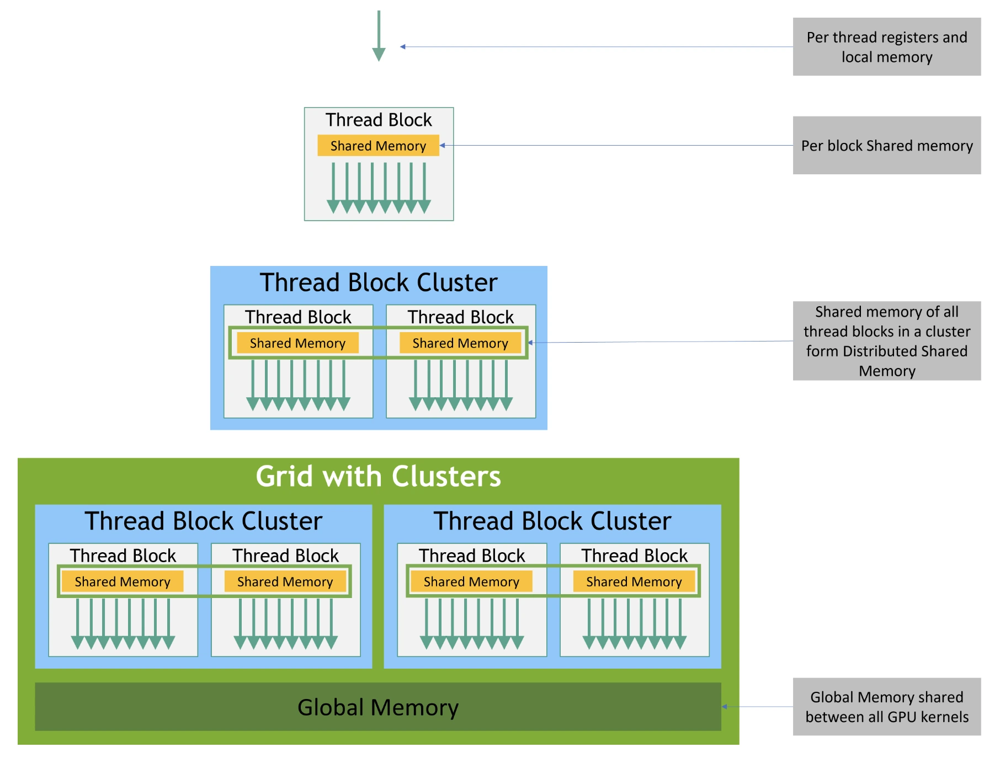

<script type="module">
  import mermaid from 'https://cdn.jsdelivr.net/npm/mermaid@10/dist/mermaid.esm.min.mjs';
  mermaid.initialize({ startOnLoad: true, theme: 'neutral' });
</script>

* Table of Contents
{:toc}

---

As we have seen in the previous [blog](../getting-started-with-cuda/), CUDA programming uses a hierarchal breakdown of workers. Threads are grouped into blocks which are further grouped into grids. 

## Memory Hierarchy in CUDA

GPUs are designed with a **hierarchical memory system**.  
Unlike CPUs, which have deep cache hierarchies, GPUs expose more memory types directly to programmers.  
This gives developers more control—but also more responsibility—to manage performance.


<br><br>

| Memory Type                | Scope / Visibility              | Latency         | Size (Typical)         | Notes                                      |
|-----------------------------|----------------------------------|-----------------|------------------------|--------------------------------------------|
| **Registers**              | Private to each thread          | ~1 cycle        | Very limited           | Fastest memory, but scarce                 |
| **Shared Memory**          | Shared within a block           | ~10–20 cycles   | 48–100 KB per SM       | Programmable, like user-managed L1         |
| **L1 Cache**               | Per Streaming Multiprocessor    | ~20–30 cycles   | ~128 KB per SM (config)| Hardware-managed, caches recent data       |
| **L2 Cache**               | Shared across all SMs           | ~200 cycles     | Few MBs                | Larger but slower than L1                  |
| **Global Memory (DRAM)**   | Accessible by all threads       | 400–800 cycles  | Several GBs            | Off-chip, highest latency                  |
| **Texture / Constant Mem.**| Global (read-only, specialized) | ~20–30 cycles   | Small (64 KB constant) | Cached, optimized for specific access      |

Among all GPU memory types, **shared memory** is unique.  
It’s *programmable*, *low-latency*, and enables **inter-thread communication**.  

This often makes the difference between a **slow CUDA kernel** and a **highly optimized one**.

---

## ⚡ What makes shared memory special?

1. **On-chip, high-performance memory**  
   - Physically implemented *inside the GPU chip* (unlike global memory, which sits in DRAM).  
   - Offers **higher bandwidth** and **lower latency**.  
   - Typically **~5× faster** than global memory.  

2. **User-managed cache**  
   - Unlike hardware-managed caches (L1/L2), shared memory is **explicitly controlled by the programmer**.  
   - This makes it a **fast, user-managed cache**, ideal for reusing data across threads.  

3. **Scoped per-block**  
   - Declared using the `__shared__` keyword inside kernels.  
   - Allocated as a **logical resource per block**:  
     - Each block gets its **own private copy** of shared memory.  
     - Data in one block’s shared memory is **not visible** to threads of another block.  

---

## Code Example Walkthrough

### Problem statement

A stencil operation refers to picking up a window/range of data. The underlying dataset on which the stencil operation was performed is much larger. 
We intend to find the result of summation of all elements in the center of the window of an odd radius R, and store it at the index of another array corresponding to that center. 

Here is the complete code. We will walk through this code step by step to understand how it works. 

```cpp
#include <stdio.h>
#include <algorithm>

using namespace std;

#define N 4096
#define RADIUS 3
#define BLOCK_SIZE 16

__global__ void stencil_1d(int *in, int *out) {
    __shared__ int temp[BLOCK_SIZE + 2 * RADIUS];
    int gindex = threadIdx.x + blockIdx.x * blockDim.x;
    int lindex = threadIdx.x + RADIUS;

    // Read input elements into shared memory
    temp[lindex] = in[gindex];
    if (threadIdx.x < RADIUS) {
      temp[lindex - RADIUS] = in[gindex - RADIUS];
      temp[lindex + BLOCK_SIZE] = in[gindex + BLOCK_SIZE];
    }

    // Synchronize (ensure all the data is available)
    __syncthreads();

    // Apply the stencil
    int result = 0;
    for (int offset = -RADIUS; offset <= RADIUS; offset++)
      result += temp[lindex + offset];

    // Store the result
    out[gindex] = result;
}

void fill_ints(int *x, int n) {
  fill_n(x, n, 1);
}

int main(void) {
  int *in, *out; // host copies of a, b, c
  int *d_in, *d_out; // device copies of a, b, c
  int size = (N + 2*RADIUS) * sizeof(int);

  // Alloc space for host copies and setup values
  in = (int *)malloc(size); fill_ints(in, N + 2*RADIUS);
  out = (int *)malloc(size); fill_ints(out, N + 2*RADIUS);

  // Alloc space for device copies
  cudaMalloc((void **)&d_in, size);
  cudaMalloc((void **)&d_out, size);

  // Copy to device
  cudaMemcpy(d_in, in, size, cudaMemcpyHostToDevice);
  cudaMemcpy(d_out, out, size, cudaMemcpyHostToDevice);

  // Launch stencil_1d() kernel on GPU
  stencil_1d<<<N/BLOCK_SIZE,BLOCK_SIZE>>>(d_in + RADIUS, d_out + RADIUS);

  // Copy result back to host
  cudaMemcpy(out, d_out, size, cudaMemcpyDeviceToHost);

  // Error Checking
  for (int i = 0; i < N + 2*RADIUS; i++) {
    if (i<RADIUS || i>=N+RADIUS){
      if (out[i] != 1)
    	printf("Mismatch at index %d, was: %d, should be: %d\n", i, out[i], 1);
    } else {
      if (out[i] != 1 + 2*RADIUS)
    	printf("Mismatch at index %d, was: %d, should be: %d\n", i, out[i], 1 + 2*RADIUS);
    }
  }

  // Cleanup
  free(in); free(out);
  cudaFree(d_in); cudaFree(d_out);
  printf("Success!\n");
  return 0;
}
```


### The shared memory tile
```cpp
__shared__ int temp[BLOCK_SIZE + 2 * RADIUS];
```
Each block loads:

- **BLOCK_SIZE** center elements (one per thread)  
- **2 × RADIUS** halo elements (*ghost cells*) to cover neighbors that cross block boundaries  

➡️ **Total per block tile size** = `BLOCK_SIZE + 2*RADIUS`

### 🧮 Thread Indexing

```cpp
int gindex = threadIdx.x + blockIdx.x * blockDim.x; // global index (0..N-1)
int lindex = threadIdx.x + RADIUS;                  // local index inside 'temp'
```
- **gindex** → the global index of the thread in the input/output arrays  
- **lindex** → the local index inside the shared memory buffer `temp[]`  

👉 `lindex` is offset by `RADIUS` so the **center of each thread’s window** sits inside the shared tile, leaving space on both sides for the halo elements.

### 📥 Coalesced Loads into Shared Memory

```cpp
temp[lindex] = in[gindex]; // all threads load their own center -> coalesced
if (threadIdx.x < RADIUS) {
  temp[lindex - RADIUS] = in[gindex - RADIUS];          // left halo (RADIUS threads)
  temp[lindex + BLOCK_SIZE] = in[gindex + BLOCK_SIZE];  // right halo (same threads)
}
__syncthreads();
```

- **Center loads** → fully coalesced (contiguous global addresses).  
- **Halo loads** → the first `RADIUS` threads load both the left and right edges for the whole block. These are also contiguous and coalesced.  
- **`__syncthreads()`** → ensures every thread sees a fully populated shared tile before computing.  

> 💡 **Why not have the last `RADIUS` threads load the right halo?**  
> This kernel instead lets the **first `RADIUS` threads** load both sides — also valid and simpler.

#### 🔒 Importance of `__syncthreads()`

All threads in a block share the same **shared memory tile**.  
When some threads load the *halo* values while others load the *center*, these writes happen in parallel but **not in lockstep**. Without `__syncthreads()`, some threads might start reading from shared memory before their neighbors have finished writing, causing *race conditions* and incorrect results.  

By calling `__syncthreads()`, you create a **barrier**:  
- 🚦 Every thread must reach this point before *any* can move forward.  
- ✅ This guarantees that the entire shared tile (center + halos) is fully loaded and visible to all threads.  
- 🧩 It ensures correctness while still allowing maximum parallelism during the load step.  


### 🧾 Compute Using the Shared Tile

```cpp
int result = 0;
for (int offset = -RADIUS; offset <= RADIUS; offset++)
  result += temp[lindex + offset];

out[gindex] = result;
```

- All neighbor reads are now **on-chip** from `temp[]` (low latency).  
- Each input element is read **once from DRAM per block** instead of multiple times per thread — this is the **data reuse win**.  

### Host-side setup

```cpp
int size = (N + 2*RADIUS) * sizeof(int);

// host alloc + init (with ghost cells at both ends)
in  = (int*)malloc(size); fill_ints(in,  N + 2*RADIUS); // all 1s
out = (int*)malloc(size); fill_ints(out, N + 2*RADIUS);

// device alloc + copy
cudaMalloc(&d_in,  size);
cudaMalloc(&d_out, size);
cudaMemcpy(d_in,  in,  size, cudaMemcpyHostToDevice);
cudaMemcpy(d_out, out, size, cudaMemcpyHostToDevice);

// launch with shifted pointers to skip boundary branching
stencil_1d<<<N / BLOCK_SIZE, BLOCK_SIZE>>>(d_in + RADIUS, d_out + RADIUS);

// copy back + verify
cudaMemcpy(out, d_out, size, cudaMemcpyDeviceToHost);
```
The input has **ghost cells** on both ends (`+ 2 * RADIUS` total).  
That’s why halo reads like:

- `in[gindex - RADIUS]`  
- `in[gindex + BLOCK_SIZE]`  

are always in-bounds.

---

## Cache vs Shared Memory


### What is cache in GPUs? 
   Modern GPUs have small hardware-managed caches (L1, L2) that automatically store recently accessed global memory values.  
   - Benefit: hides some global memory latency.  
   - Limitation: not fully under programmer control,  caching is implicit, and performance can be unpredictable.

### Early GPUs had no cache  
   The first generations of CUDA-capable GPUs didn’t include cache at all. Every global memory access had to go directly to DRAM, making memory latency a huge bottleneck.

### Why is shared memory powerful?  
   Shared memory is programmer-managed scratchpad memory inside each SM (Streaming Multiprocessor).  
   - ⚡ **Faster atomics** – atomic operations in shared memory are much faster than in global memory.  
   - 🏦 **More banks** – it is organized into multiple banks, allowing high-bandwidth parallel access.  
   - 🎯 **Predictable performance** – since you control what data is loaded and when, shared memory avoids the uncertainty of hardware caching policies.  

<details>
  <summary>🏦 What Are Banks in GPU Shared Memory?</summary>
  <div style="background-color:#f5f5f5; padding:12px; border-radius:6px; margin-top:8px;">
    <ul>
      <li><b>Shared memory is split into "banks".</b><br>
          Think of shared memory as a big library. Each <i>bank</i> is like a separate bookshelf that can be accessed independently.
      </li>

      <li><b>One thread ↔ one bank (ideally).</b><br>
          When multiple threads in a warp access shared memory, the hardware maps each access to a bank.
          <ul>
            <li>If each thread in the warp goes to a <b>different bank</b>, all accesses happen <b>in parallel</b> → full bandwidth.</li>
            <li>If two or more threads go to the <b>same bank</b>, a <b>bank conflict</b> occurs → their accesses are serialized, slowing things down.</li>
          </ul>
      </li>

      <li><b>Why banks exist.</b><br>
          They allow high-bandwidth parallel memory access inside shared memory. Instead of one thread-at-a-time, you get many simultaneous accesses (like 32 banks for 32 threads in a warp).
      </li>

      <li><b>Modern GPUs.</b><br>
          Typically, shared memory has <b>32 banks</b>, each 4 bytes wide. This matches the 32 threads in a warp → one bank per thread is the sweet spot. Some GPUs also allow 8-byte mode (for doubles).
      </li>
    </ul>

    <p>✅ <b>In short:</b> Banks are subdivisions of shared memory that let multiple threads access different locations at once. Avoiding bank conflicts is key to getting the speed advantage of shared memory.</p>


<div class = "mermaid">
flowchart LR
    subgraph Group of 32 threads in a block
      T0[Thread 0] --> B0
      T1[Thread 1] --> B1
      T2[Thread 2] --> B2
      T3[Thread 3] --> B3
    end

    subgraph Banks
      B0[Bank 0]
      B1[Bank 1]
      B2[Bank 2]
      B3[Bank 3]
    end
  </div>
  </div>
</details>

---

## 💾 DRAM (Global Memory)

DRAM (Dynamic Random Access Memory) is the large off-chip global memory of the GPU. It holds most of the data (arrays, tensors, etc.) that kernels work on. It has high capacity but is also the *slowest* memory in the hierarchy.

- Memory fetched in groups of 32 bytes:  The memory controller always transfers data in 32-byte (or larger) chunks.  
   - If a thread needs only **1 byte**, the entire 32-byte segment is still fetched → leading to **wasted bandwidth**.

- Can’t ask for an exact byte: Threads cannot request a single arbitrary byte efficiently. Instead, the hardware fetches the aligned block that contains it.

- Benefit: **Broadcasting**:  When multiple threads in a warp read the **same location**, the GPU can **broadcast** the value to all of them with a single DRAM fetch, saving bandwidth.

---

## Conclusion

This post is part of my ongoing learning journey through the **[OLCF (Oak Ridge Leadership Computing Facility) CUDA Training Series by NVIDIA](https://www.olcf.ornl.gov/cuda-training-series/)**. Link to the code examples are present on [GitHub](https://github.com/olcf/cuda-training-series/tree/master). 

The explanations are based on what I understood from the lectures, and all images/figures used here are borrowed from the official OLCF materials, and from NVIDIA documentation. 

Stay tuned — I’ll continue sharing more notes and experiments as I progress through the rest of the lectures, and try new GPU based projects!  

--- 