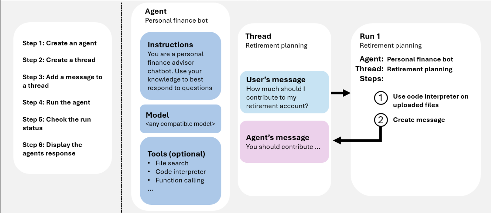

* Table of Contents
{:toc}

---
In this blog, we discuss about the concepts behind building agents on Azure, with main focus around Azure AI foundry. 

Keep reading to get a quick understanding of concepts and all resources you can use to start building on AI foundry!

---

# 🧠 What Are AI Agents?

**In simple terms:**  
> **AI Agents = LLM Model + Action + Knowledge Base**

That’s the most concise way to define an AI Agent.  

An **AI Agent** uses a **Large Language Model (LLM)** to understand natural language, can **perform actions** through tools or APIs, and relies on a **knowledge base** to make its responses contextually accurate and grounded.

## 💡 Example: Multi-Agent System in a Company

Imagine a company building an internal solution that automatically detects and fixes issues in its software systems.  
Because the system is complex, the company employs **multiple specialized AI Agents**, each responsible for a particular task — such as diagnosis, remediation, documentation, or communication.

A central **orchestrator agent** coordinates all of them, deciding which agent should act based on the user’s request.

These agents draw knowledge from:
- 🧾 Tech support manuals and public documentation  
- 📚 Internal company documents and configuration data  
- 💬 Historical issue logs and user feedback  

Before taking any critical action (like system restarts or data deletions), the system **asks the end user for explicit permission** — ensuring safety and accountability.

## 🧩 Evaluation and Safety of Agents

As part of the company’s internal audit process, every Agentic AI system must pass automated evaluations for:  
- **Safety** – ensuring no harmful or destructive behavior  
- **Coherence** – producing logically consistent and relevant responses  
- **Grounding** – staying factual and aligned with verified knowledge sources  
- **Reliability** – maintaining consistent tool accuracy (e.g., **Tool Call Accuracy**)

These evaluations ensure that the agents operate responsibly and can be trusted in production environments.

---

# ⚙️ Platforms to Build AI Agents on Azure

Azure offers a complete ecosystem for building AI Agents — from **no-code** tools for business users to **developer-centric frameworks** for advanced multi-agent systems.  
All you need is an **idea** and the **drive to build**.

## Copilot Studio — For Business Users

For business users with little or no coding experience, **Copilot Studio** provides an intuitive, no-code way to build agents directly within **Microsoft 365 Copilot Chat**.  
These **declarative agents** can automate everyday tasks, streamline workflows, and boost productivity — all with minimal IT involvement.

When users are comfortable with **low-code tools** like **Microsoft Power Platform**, Copilot Studio enables them to combine their technical skills with deep **business domain knowledge** to create richer, more powerful agents.

Such agents can extend the capabilities of Microsoft 365 Copilot or bring AI-powered automation into channels like:
- 💬 **Microsoft Teams**
- 🧵 **Slack**
- 💡 **Messenger**

## 💻 2. Microsoft 365 Agents SDK — For Professional Developers

When organizations need **advanced custom extensions** to Microsoft 365 Copilot, developers can use the **Microsoft 365 Agents SDK**.  
This SDK offers programmatic control, allowing professional developers to:
- Integrate custom APIs or tools  
- Implement sophisticated logic  
- Deploy agents that work across the same channels as Copilot Studio  

This is ideal for scenarios requiring fine-grained control, external integrations, or custom business workflows.

## ☁️ 3. Azure AI Foundry — For Complex, Scalable Agents

For full-stack agentic development, Azure provides the **Foundry Agent Service**, a developer-first platform that allows integration with:
- ⚙️ **Azure AI Services** (for language, vision, and speech)
- 🧠 **Custom model endpoints** (OpenAI, OSS, or fine-tuned models)
- 📦 **Custom storage and search systems** (like Azure Cognitive Search, Cosmos DB, or Blob Storage)

Start with the **Foundry Agent Service** to develop single, standalone agents.  
Then, when you’re ready to scale up and orchestrate multiple agents working together, use **Semantic Kernel** to build **multi-agent systems** that collaborate intelligently.

Hence, in summary: 

| Use Case | Recommended Platform | Key User Type |
|-----------|----------------------|----------------|
| Simple task automation in Microsoft 365 | **Copilot Studio** | Business users |
| Custom logic and integrations with Copilot | **Microsoft 365 Agents SDK** | Professional developers |
| Advanced, scalable, multi-agent systems | **Azure AI Foundry + Semantic Kernel** | AI/ML engineers and developers |

Azure’s agentic ecosystem ensures there’s a path for everyone — from **citizen developers** to **AI professionals** — to bring intelligent automation to life.

---

# Overall Architecture of Azure AI Foundry

In this blog, we will cover the overall concepts and architecture, and for step by step how to -  you can refer to the official documentation shared by Azure:  [Building agents on AI Foundry](https://learn.microsoft.com/en-us/azure/ai-foundry/agents/quickstart?pivots=ai-foundry-portal)

## An Overview on Agents 

### Key Concepts

Agent has three components - LLM Model, tool, knowledge base. 

1. LLM Model: the reasoning and language backbone
2. Tools: Knowledge / grounding tools — e.g. Bing Search, Azure AI Search, File Search, Microsoft Fabric, and domain-specific licensed data sources; Action / execution tools — e.g. OpenAPI tool (wrap existing APIs), Azure Functions, Logic Apps,; MCP integration
3. Multi-Agent Support: Foundry supports Connected Agents, allowing you to build multi-agent systems without needing to handcraft orchestration logic. The main agent can delegate tasks to specialized agents naturally.

### Agent Identity & API Access

Every agent created in Foundry has a **unique Agent ID**, which serves as its identity across the platform.  
This **Agent ID** can be used programmatically to:

- **Fetch agent metadata** (name, configuration, tools, etc.)  
- **Run or test agents** using Azure SDKs or REST APIs  
- **Integrate agents** with other Foundry services, pipelines, or evaluation workflows 

## What are Threads and Runs? 
In Azure AI Foundry, **threads** represent the *conversational or execution context* of an agent.  
Every interaction — whether it’s a user query, a tool invocation, or a multi-turn conversation — happens inside a **thread**.

You can think of a thread as the **stateful container** that holds all messages, metadata, and context for a particular run of an agent.

A **thread** is a persistent object that maintains:
- The **conversation history** (all user and agent messages)
- The **tool call logs** (which actions were invoked and with what parameters)
- The **execution metadata** (timestamps, run IDs, evaluations, etc.)
- The **state of the agent’s reasoning process**  

Each thread can contain multiple **runs**, and each run represents a single execution attempt or response generation within that thread.

This structure lets developers resume, inspect, or replay an agent’s reasoning — making debugging and evaluation much easier.

### Utility of Threads in Multi-Agent Systems and Production

When working with connected agents, each agent typically has its own thread, enabling clear separation of context.
The orchestrator agent may spawn or coordinate multiple threads across different agents to complete a complex workflow.

For example:
- The Planner Agent starts a thread for task decomposition
- The Research Agent runs its own thread for data collection
- The Writer Agent uses its thread to draft the response

All of these threads are tracked together under a shared session context, preserving visibility across the system. 

These are features of threads in **Production**. 

- Traceability – View every message, tool call, and result
- Replayable – Re-run previous conversations or scenarios
- Lightweight state – Bring-your-own storage (e.g., Cosmos DB) for persistence
- Integration – Threads can be monitored and visualized in the Foundry Studio UI

### 🔑 Thread Identity & Access

Just like agents, each thread in Foundry has a **unique Thread ID**, which can be used programmatically to fetch or update its state.

## How do Threads, Runs and Messages come together?

A **message** is the fundamental communication unit inside a thread.  
Messages can come from:
- 🧑 **User** – asking a question, submitting a command, or giving feedback  
- 🤖 **Agent** – replying, calling a tool, or returning a result  
- ⚙️ **Tool** – providing data or an action result back to the agent  

Each message is stored chronologically inside its parent thread, maintaining the conversational flow and memory.

A **run** represents one *execution cycle* of the agent inside a thread.  
When a new message is received, the agent starts a **run** to process that input — which may involve:
1. Reading the message and prior context  
2. Reasoning using the LLM  
3. Calling external tools or APIs  
4. Producing one or more output messages  

Each run is tracked individually for **traceability** and **evaluation**, making it easy to inspect how a particular response was generated.

### 🔗 Putting It All Together

Here’s how these components interact during a typical user request:

1. **User sends a message** → Foundry creates or retrieves a **thread**  
2. **A new run** is started under that thread  
3. The agent processes the input, optionally calls tools, and generates new **messages**  
4. Each message and tool call is logged within the same thread  
5. The run completes, and its outputs become part of the thread’s state  

*Figure 1: How Agents, Threads, Messages and Runs work*

## Deployment And Scalability Behind The Scenes 

- **Fully Managed by Azure** — Agents and threads run in a managed compute fabric; no manual provisioning of VMs, containers, or scaling rules is needed.
- **Auto-Scaling Runtime** — The platform automatically scales compute resources to handle spikes in concurrent requests, long-running tasks, or multi-agent workflows.
- **Bring-Your-Own Storage (BYOS)** — Use services like **Azure Cosmos DB**, **Blob Storage**, or **Azure Table Storage** to persist thread states, logs, and agent data for continuity and disaster recovery.
- **Regional Deployment & Data Residency** — Choose regions to comply with data governance and privacy requirements; all computation and storage stay within your tenant’s boundary.
- **Resilient Execution Model** — Foundry isolates each run, enabling safe retries and fault-tolerant execution in case of transient errors or model timeouts.
- **Observability & Metrics** — Integrates with **Azure Monitor** and **Application Insights** to track latency, throughput, and error rates across runs and threads.
- **Versioned Agent Deployment** — Agents can be published with version tags, enabling blue-green or canary rollouts and quick rollback if issues occur.
- **Enterprise Security & Networking** — Supports **VNET integration**, **private endpoints**, and **Microsoft Entra (Azure AD)** for identity and access management.
- **Continuous Evaluation Loop** — Deployed agents can be monitored using built-in evaluation pipelines (grounding, coherence, tool accuracy) to ensure quality doesn’t regress over time.
- **CI/CD Integration** — Foundry SDK and CLI allow agents to be registered, updated, and deployed through automated pipelines using GitHub Actions or Azure DevOps.

Azure AI Foundry provides a **serverless-style runtime** for AI Agents — combining **managed compute**, **elastic scaling**, **observability**, and **secure deployment pipelines** so you can move seamlessly from prototype to enterprise-scale production.

---

# Resources to learn about Azure AI Foundry

**Public Documentation**: These are official **Microsoft**'s documentation, along with sample codes which you can try out. 

- [Azure's comprehensive documentation on AI Foundry](https://ai.azure.com/doc/azure/ai-foundry/what-is-azure-ai-foundry)

- [Sample Codes on Microsoft's Official Github Repository](https://github.com/azure-ai-foundry/foundry-samples/tree/main/samples)

**Starter Projects**: These are ideas by developers and Microsoft for anyone to get started building. I will update this list as I find more interesting blogs. 

- [Awesome Agentic AI Use Cases](https://github.com/ashishpatel26/500-AI-Agents-Projects)
- [Microsoft's beginner course on building AI Agents in 12 lessons!](https://github.com/microsoft/ai-agents-for-beginners)
- [Building a multi-agent system using Microsoft's AI Agent service](https://devblogs.microsoft.com/semantic-kernel/guest-blog-build-a-multi-agent-system-using-microsoft-azure-ai-agent-service-and-semantic-kernel-in-3-simple-steps/)

**Certifications to Learn About Agentic AI**: Certifications from verified sources are a good way to learn from ground up and enhance your resume. 

- [AI-102 Azure AI Engineer Associate AI](https://learn.microsoft.com/en-us/credentials/certifications/azure-ai-engineer/?practice-assessment-type=certification)

- [Andrew NG's course on Agentic AI](https://www.deeplearning.ai/courses/agentic-ai/?utm_campaign=agentic-ai-launch&utm_medium=hero-takeover&utm_source=dlai-homepage)

- [Short courses on latest development in AI](deeplearning.ai)

- [Free Microsoft Learn Resources](https://learn.microsoft.com/en-us/training/modules/)

**Stay Up-To-Date On Latest Developments in Microsoft**: Staying on top of latest developments in tech - you can refer to the material of latest conferences by Microsoft, developer blogs and even official documentation of AI Foundry!

- [Latest updates in Azure AI Foundry](https://ai.azure.com/doc/azure/ai-foundry/whats-nxew-azure-ai-foundry)

- [Microsoft Ignite](https://ignite.microsoft.com/en-US/home)

- [Microsoft Developer Blogs](https://devblogs.microsoft.com/)

# Conclusion
And with this blog, we have got a quick understanding on building AI agents on Azure, and the list of resources to go through. 

In the next part of this blog series - we will take a use case of how to evaluate a multi-agentic AI flow on AI foundry, which is a project I have personally worked on as a part of Microsoft's Global Hackathon. 

