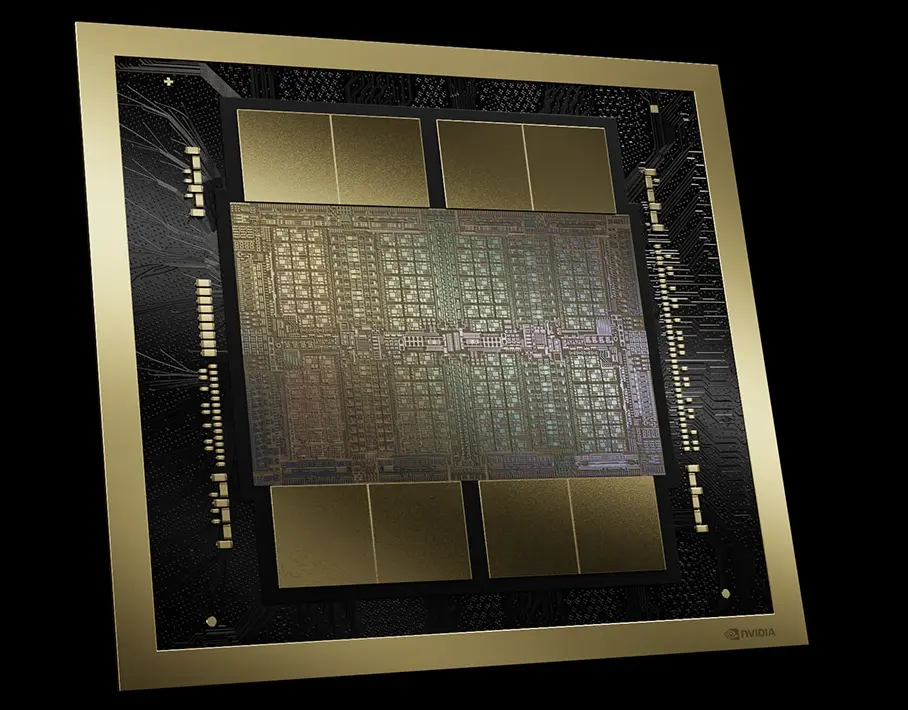
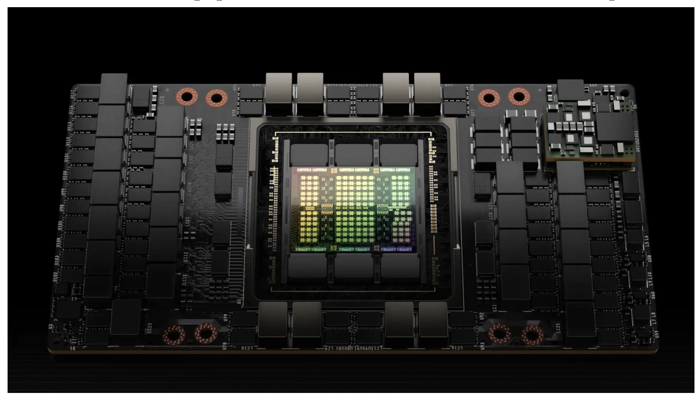

* Table of Contents
{:toc}

---

Link to the technical whitepaper: [NVIDIA Blackwell Architecture Technical Brief](https://resources.nvidia.com/en-us-blackwell-architecture?ncid=no-ncid)

  <strong><em>A single Blackwell GPU chip</em></strong>

# Why the Name “Blackwell”?

NVIDIA’s architectures have long carried the names of pioneering thinkers — **Hopper** after Grace Hopper, **Lovelace** after Ada Lovelace, **Kepler**, **Turing**, and now **Blackwell**.  
The tradition honors those whose ideas reshaped science and computation itself.

**Dr. David Harold Blackwell (1919–2010)** was a trailblazing mathematician and statistician whose work bridged probability, game theory, and information theory.  
He co-authored *Theory of Games and Statistical Decisions*, published more than 80 papers, and co-developed the **Rao–Blackwell Theorem**, a cornerstone of modern statistical inference.

  <strong><em>Dr. David H. Blackwell</em></strong>

Blackwell was also a historic first — the **first Black scholar elected to the U.S. National Academy of Sciences**, and later honored posthumously with the **National Medal of Science (2012)**.  
His legacy lives at the intersection of mathematics and intelligence — the same space NVIDIA’s new architecture now explores.

> *“In honoring Blackwell, NVIDIA nods to the mathematics of reasoning itself — the very foundation of modern AI.”*

📖 Read more: [*The Enduring Legacy of a Howard Luminary in the Age of AI*](https://thedig.howard.edu/all-stories/dr-david-harold-blackwell-enduring-legacy-howard-luminary-age-ai)

---

# From Bigger Models to Longer Reasoning

For years, progress in AI has followed a simple scaling law — train larger models on more data. But Blackwell marks the beginning of another curve: test-time scaling, sometimes called long-thinking inference.

Instead of training bigger models, we now explore what happens when we allow a trained model to use more compute while reasoning — to “think longer,” evaluate multiple hypotheses, or process much larger contexts at inference time.

graph LR
A[Training-time Scaling] -->|↑ Model Size| B(Higher Capability)
C[Test-time Scaling] -->|↑ Inference Compute| B

NVIDIA calls this a new scaling law for intelligence. And it’s built deep into the architecture — from dual-die 10 TB/s interconnects that make distributed inference seamless, to low-precision FP4 formats that free up capacity for larger reasoning workloads.

Where traditional scaling ended with training, Blackwell extends it into thought. It’s not just about building bigger models anymore — it’s about letting them think longer.

---

# From Hopper to Blackwell: Quantifying the Leap

So how much of a leap is Blackwell? In NVIDIA’s own benchmarks and partner systems you’ll see up to 30× inference performance over Hopper in large-scale LLM clusters, ~2.5× raw compute in certain AI formats, and ~30 % gains in traditional FP64 workloads. The key gains come from boosted interconnect, massive memory and new low-precision formats — but as always, real-world gains will vary by workload.

  <strong><em>A single Hopper GPU chip</em></strong>

| Feature / Metric                      | **Hopper (H100)**             | **Blackwell (B100 / GB200)**                                     | **Improvement**              |
| ------------------------------------- | ----------------------------- | ---------------------------------------------------------------- | ---------------------------- |
| **Architecture Year**                 | 2022                          | 2024                                                             | —                            |
| **Process Node**                      | TSMC 4N                       | TSMC 4NP (enhanced 4N)                                           | ~10–15% density/power gain   |
| **Transistor Count**                  | ~80 B                         | ~208 B                                                           | **≈ 2.6×** more              |
| **Compute Precision (AI)**            | FP16, BF16, FP8               | FP8, **FP4**, FP6                                                | + new low-precision formats  |
| **Peak AI Throughput**                | ~4 PFLOPS FP8                 | **~20 PFLOPS FP4**, ~8 PFLOPS FP8                                | **≈ 2–5×** per GPU           |
| **NVLink Bandwidth (per GPU)**        | 900 GB/s (NVLink 4)           | **1.8 TB/s (NVLink 5)**                                          | **≈ 2×** faster interconnect |
| **Chip-to-Chip Bandwidth**            | —                             | **10 TB/s dual-die link**                                        | —                            |
| **Memory Capacity (HBM)**             | 80 GB HBM3                    | **192 GB HBM3e**                                                 | **2.4×** larger              |
| **Memory Bandwidth**                  | 3.35 TB/s                     | **8 TB/s**                                                       | **≈ 2.4×** higher            |
| **Inference Performance (LLMs)**      | Baseline (1×)                 | **Up to 30×** faster (in NVL72 config)                           | **Up to 30×**                |
| **Energy Efficiency (LLM inference)** | —                             | **Up to 25× lower cost/power**                                   | Huge efficiency gain         |
| **Max Coherent GPUs (via NVSwitch)**  | 256 GPUs                      | **576 GPUs**                                                     | **2.25× scaling domain**     |
| **Focus Areas**                       | Training efficiency, FP8 math | **Inference scaling, test-time compute, long-context reasoning** | Conceptual shift             |

---

# The Blackwell Platform — From a Chip to an AI Factory

One of the most misunderstood aspects of the Blackwell generation is that it isn’t just a *GPU architecture* — it’s a **system architecture**.  
Every innovation inside Blackwell — from NVLink 5 and FP4 precision to the RAS engine — was designed not for a single card, but for the *entire stack* that scales from chips to data centers.

At the silicon level, the **Blackwell GPU** introduces all the core innovations:  
**dual-die NV-HBI links (10 TB/s)**, **micro-tensor scaling**, **FP4 Tensor Cores**, and **second-generation Transformer engines**.

These GPUs then fuse into the **GB200 Superchip**, pairing **two Blackwell GPUs with one Grace CPU** through NVLink-C2C channels running at 900 GB/s each.  
Together, they operate as a unified compute unit — merging the low-latency strengths of CPUs with the parallelism of GPUs.

Stack 36 of those GB200 units — **72 Blackwell GPUs + 36 Grace CPUs** — and you get the **GB200 NVL72**, a rack-scale system that behaves as *one coherent AI supercomputer*.  
With fifth-generation NVLink and NVSwitch 5 interconnects, the NVL72 achieves **130 TB of unified memory** accessible across all GPUs — turning a rack into a single, distributed memory space for trillion-parameter models.

This scaling philosophy extends even further in **GB300-class systems**, which interconnect multiple NVL72s into a seamless AI factory — an entire datacenter that thinks as one model.

> *Blackwell’s true breakthrough isn’t just faster silicon — it’s a shift from GPUs as devices to GPUs as a distributed reasoning system.*

---

# Architectural Innovations in BlackWell Architecture 

The NVIDIA **Blackwell** architecture represents a generational leap not only in performance but in design philosophy — bridging the physical limits of silicon with the computational needs of modern AI.  
Below are the major innovations that define this architecture.

## Faster NVIDIA NV-Link Connects

Blackwell introduces the **5th-generation NVLink** and **NVSwitch** domains, allowing up to **~1.8 TB/s of bidirectional bandwidth per GPU** — roughly double what Hopper achieved.  
In addition, the dual-die “GB200 Ultra” class implements a **custom NV-High Bandwidth Interface (NV-HBI)**, delivering **10 TB/s** between the two GPU dies.  
This allows them to behave as a **single coherent accelerator**, minimizing inter-GPU latency and boosting scaling efficiency across multi-GPU systems.

*What it enables:*  
Large models can be distributed across far more GPUs with minimal communication overhead — a core requirement for **test-time scaling** and distributed model-parallel training.

> *“Up to 1.8 TB/s per GPU via NVLink 5.0, with 10 TB/s intra-GPU die link.”*  

## New Second-Generation Transformer Engine

At the heart of Blackwell lies its **second-generation Transformer engine**, built to accelerate attention, context, and inference for trillion-parameter LLMs.

Key components and concepts include:

- **Hardware refinements** to the Transformer pipeline for higher throughput and reduced attention latency.  
- **Micro-tensor scaling**, which dynamically adjusts precision at the sub-tensor level, effectively **doubling FP4 Tensor Core performance**, **doubling parameter bandwidth**, and **doubling model size per GPU**.  
- **4-bit quantization support (FP4 / NVFP4)** — allowing massive reductions in memory footprint while maintaining accuracy.  
- **Integration with NVIDIA’s AI stack:**
  - **NVIDIA Dynamo** — dynamic graph optimization and execution.
  - **TensorRT-LLM** — inference optimization framework enabling 4-bit precision and kernel-level parallelism.
  - **NeMo + Megatron frameworks** — training environments that leverage mixed precision and model disaggregation.

Together, these components create a hardware-software loop where the GPU and frameworks are co-designed for reasoning and inference speed.

> *“Quantization to 4-bit precision, custom kernel parallelism, mapping, and disaggregation.”*  

## Decompression Engine + SPARKS RAPIDS Libraries

Blackwell incorporates a **dedicated decompression engine** to handle the massive data throughput required by compressed model weights and activations.  
This engine ensures that even compressed data streams can feed the tensor cores at full speed, preventing memory bottlenecks.  

The decompression path integrates with **NVIDIA’s SPARKS / RAPIDS libraries**, allowing developers to leverage GPU-accelerated data pipelines directly within AI workloads.  
This combination ensures that models, datasets, and tensors remain GPU-resident — dramatically reducing CPU round-trips and I/O overhead.

  <strong><em>NVIDIA's RAPID library</em></strong>

## NVIDIA Confidential Computing

Blackwell becomes the **first GPU architecture to integrate full confidential computing support**.  
It includes hardware-enforced **trusted execution environments (TEEs)** and **encrypted memory / NVLink channels**, protecting both model weights and data during training and inference.  

This ensures sensitive or proprietary AI workloads — such as private LLMs or enterprise data pipelines — can execute securely *with negligible performance loss* compared to unencrypted execution.

> *“Secure model execution with inline encryption and TEE-level isolation, maintaining near-identical throughput.”*  
> — NVIDIA Blackwell Platform Overview (2024)

## Dual-Die Design — 10 TB/s NVIDIA High-Bandwidth Interface

Blackwell GPUs adopt a **multi-chip module (MCM)** design.  
Two large reticle-limited dies are linked using **NV-HBI (High Bandwidth Interface)** with an extraordinary **10 TB/s bidirectional throughput**, forming a unified GPU with shared memory and cache coherence.  

This dual-die design reduces inter-GPU communication overhead while providing the aggregate compute and memory footprint of two chips — effectively allowing **“one GPU to think like two.”**

*Impact:* Enables larger model footprints per GPU, reduced latency during cross-die communication, and seamless distributed inference.

## New Number Formats in Tensor Core Architecture

Blackwell’s tensor cores introduce an expanded numeric range, including **FP4**, **FP6**, **NVFP4**, and **MXFP** formats alongside FP8, FP16, and BF16.  

These **microscaled precision formats** dramatically improve performance and energy efficiency for AI inference workloads by storing weights and activations in fewer bits — without compromising output quality.

| Format | Precision | Use Case |
|:--|:--|:--|
| **FP16 / BF16** | 16-bit floating point | Training and high-accuracy inference |
| **FP8** | 8-bit float | Hopper baseline, fast training/inference |
| **FP6 / FP4 / NVFP4** | 4–6 bit microscaled formats | Efficient inference, long-context reasoning |
| **MXFP (micro-tensor scaling)** | Dynamic sub-tensor scaling | Mixed precision across tensor tiles |

> *“By supporting native FP4 computation, Blackwell effectively shifts the scaling curve — not by building larger models, but by enabling deeper reasoning per watt.”*  

## Reliability, Availability, and Serviceability — The RAS Engine

Among Blackwell’s quieter but deeply impactful innovations lies the **RAS (Reliability, Availability, and Serviceability) engine** — a system built to keep large-scale GPU clusters running with near-zero downtime.

Instead of reacting to hardware faults after they occur, the RAS engine continuously monitors the system, providing **in-depth diagnostic insights** that highlight potential issues before they escalate.  
When anomalies do appear, it can **localize the root cause rapidly**, reducing the turnaround time for investigation and allowing administrators to take precise corrective action rather than broad system resets.

This proactive approach minimizes downtime and ensures **uninterrupted large-scale training and inference workloads**.  
Administrators can dynamically adjust compute resources, fine-tune checkpointing strategies, or activate **standby GPU capacity** to maintain performance — ensuring critical AI training jobs finish on time with minimal degradation.

If a component does need replacement, the RAS engine coordinates maintenance intelligently, allowing hardware swaps to be scheduled during planned service windows.  
That means no surprises, no unplanned downtime — just continuous operation at hyperscale.

> *Blackwell’s RAS engine transforms failure recovery into proactive orchestration — keeping AI factories online, efficient, and self-aware.*

---

### **Conclusion**

Hopper scaled the training curve; **Blackwell extends it into reasoning.**  
With every terabyte of bandwidth and every 4-bit operation, NVIDIA isn’t just chasing speed — it’s rewriting what scaling means.

For the first time, inference itself has become a creative act — one that trades more compute for more thought.  
It’s a fitting homage to *David Blackwell*: an architecture built on the same foundations he explored — **probability, information, and decision** — but now running at the speed of light.

> *“In Blackwell’s world, intelligence isn’t how fast you learn — it’s how deeply you think.”*

**References:**  
- [NVIDIA Blackwell Architecture Overview](https://resources.nvidia.com/en-us-blackwell-architecture?ncid=no-ncid)  
- [NVIDIA Developer Blog – Inside Blackwell Ultra](https://developer.nvidia.com/blog/inside-nvidia-blackwell-ultra-the-chip-powering-the-ai-factory-era/)  
- [NVIDIA TensorRT-LLM and FP4 Formats](https://developer.nvidia.com/blog/introducing-nvfp4-for-efficient-and-accurate-low-precision-inference/)  
- [Exact Blog – NVIDIA Blackwell Explained](https://www.exxactcorp.com/blog/hpc/nvidia-blackwell-architecture)  
- [NexGenCloud Performance Benchmarks](https://www.nexgencloud.com/blog/performance-benchmarks/nvidia-blackwell-vs-nvidia-hopper-a-detailed-comparison)

