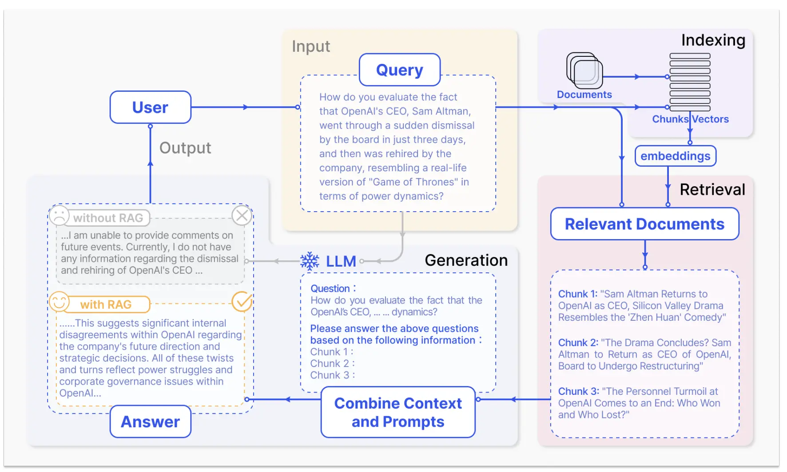
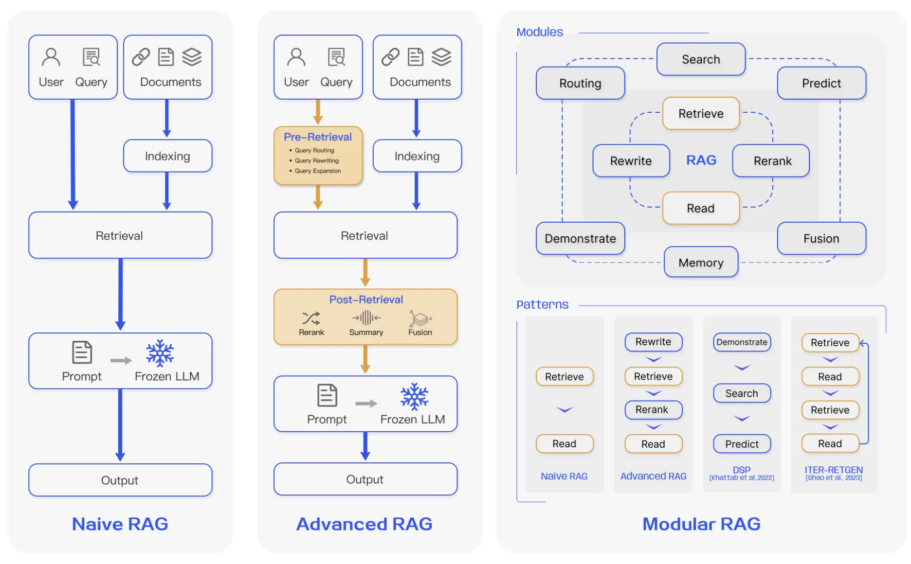
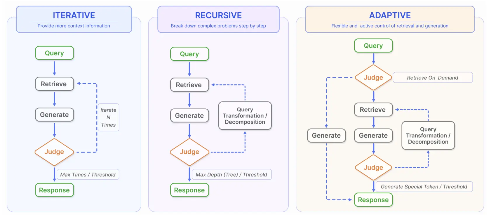
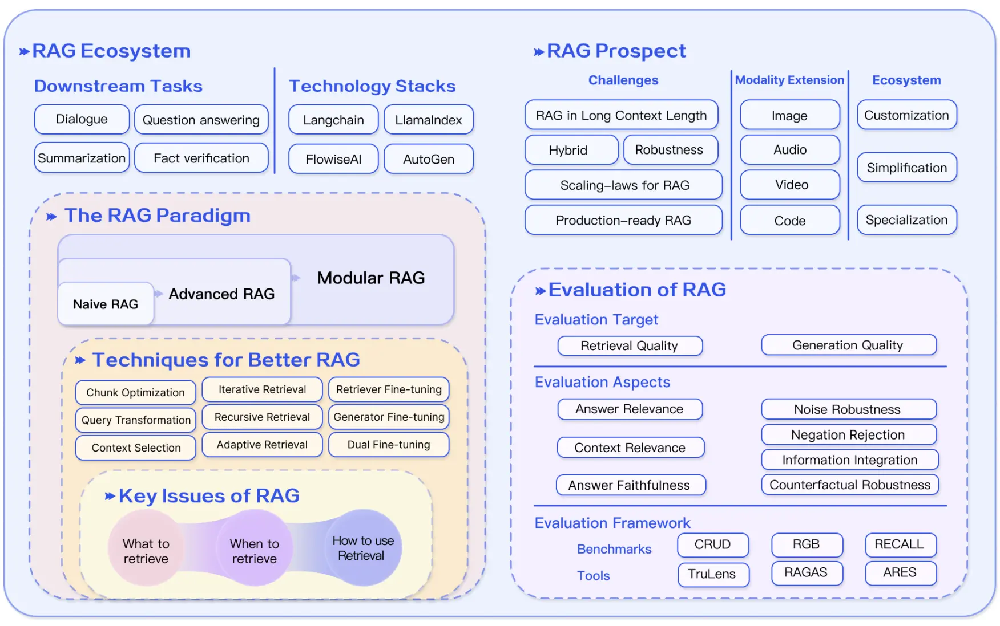

* Table of Contents
{:toc}

---

In this post, I explore the 2023 survey paper on Retrieval-Augmented Generation (RAG) techniques — a comprehensive study on how modern systems perform efficient knowledge retrieval and integration.

*Please note that the content and images have been taken from the research paper, unless otherwise mentioned.*

# Paper at a Glance

- **Title:** *Retrieval-Augmented Generation for Large Language Models: A Survey*  
- **DOI:** [https://doi.org/10.48550/arXiv.2312.10997](https://doi.org/10.48550/arXiv.2312.10997)  
- **Number of Citations:** 3,000+ (as of 2025)  
- **Date of Submission:** 18 December 2023  
- **Published on:** [arXiv](https://arxiv.org/abs/2312.10997)  
- **Authors & Affiliations:**  
  Shanghai Research Institute for Intelligent Autonomous Systems, Tongji University  
  Shanghai Key Laboratory of Data Science, School of Computer Science, Fudan University  
  College of Design and Innovation, Tongji University  

- **Core Topics Covered:**  
  - Retrieval-Augmented Generation (RAG)  
  - Large Language Models (LLMs)  
  - Knowledge Retrieval & Integration  
  - Generative AI and NLP  
  - Information Retrieval & Hallucination Mitigation  
  - Model Evaluation and Benchmarking  
  - Machine Learning & Deep Learning  
  - Survey and Comparative Studies in AI Research

---

# Introduction

In this post, I’m summarizing *“Retrieval-Augmented Generation for Large Language Models: A Survey”* — a foundational paper that dissects how RAG enhances LLMs through external knowledge integration. The paper explores everything from **RAG’s core variants (naive, advanced, modular)** to its comparisons with **fine-tuning** and **prompt engineering**. It dives deep into the **retrieval process**, **generation improvements**, and **augmentation strategies**, followed by a detailed look at **evaluation benchmarks** and open challenges.  

I’ve condensed the main insights into a structured, easy-to-read format, and added a **2025 perspective** along with my *personal reflections* on where RAG research is headed next.

---

# What is RAG?
Retrieval-Augmented Generation (RAG) is a framework that enhances Large Language Models (LLMs) by allowing them to *retrieve* relevant external information before generating a response.  
LLMs often hallucinate or generate outdated information because their knowledge is frozen at training time.  

Instead of relying solely on their pre-trained knowledge, RAG models dynamically pull facts or context from external databases or document.

**Core Idea**  
It integrates two components:
1. **Retriever** → Finds relevant documents/passages from a knowledge base.  
2. **Generator** → Uses the retrieved information to produce a coherent, context-aware response.

**Typical Workflow**  
Overall, all RAG methods entail this workflow. 

1. **User Query →** RAG system searches a knowledge source (e.g., Wikipedia, internal docs).  
2. **Retriever Output →** Top relevant documents are fed into the LLM.  
3. **Generator →** Produces an answer conditioned on both the query and retrieved content.

**Real-world Examples**   
RAG has become very common in the world of AI.

- OpenAI’s GPT models using retrieval plugins or vector databases.  
- Bing Copilot and Perplexity AI grounding answers in real-time search results.  
- Enterprise systems combining LLMs with private document repositories.

---
# RAG Paradigms: Naive, Advanced, and Modular

## Naive RAG

The **Naive RAG** paradigm represents the earliest and most straightforward implementation of Retrieval-Augmented Generation — a method that gained prominence soon after the rise of ChatGPT. It marked the starting point for integrating retrieval systems with large language models to enhance factual accuracy and contextual grounding.

### Indexing  
This stage involves **cleaning and extracting raw data** from diverse formats such as PDFs, HTML pages, Word documents, and Markdown files. The extracted content is standardized into plain text and divided into **small, digestible chunks**. Each chunk is then converted into a numerical vector representation using an embedding model and stored in a **vector database** for efficient retrieval.

### Retrieval  
When a user submits a query, the system encodes it using the **same embedding model** used during indexing. It then computes similarity scores between the query vector and stored chunk vectors to identify the most relevant passages. However, **Naive RAG struggles with precision and recall** — misaligned or poorly chunked data can result in irrelevant or redundant retrievals.

### Generation  
Finally, the retrieved passages and the user’s query are **merged into a single prompt** and passed to the large language model, which generates a response. While this approach enhances factual grounding, it often suffers from **hallucinations, bias, and toxicity** in the generated text.  
Additionally, Naive RAG may produce **incoherent or repetitive outputs** when multiple retrieved passages overlap. Determining the relevance and weight of each passage, ensuring tonal consistency, and avoiding over-reliance on retrieved content remain significant challenges. Often, a single retrieval pass fails to provide sufficient context, leading the model to **echo retrieved text rather than synthesize new insights**.

## Advanced RAG

The **Advanced RAG** paradigm builds upon the limitations of the naive approach by introducing sophisticated **pre-retrieval** and **post-retrieval** techniques. These enhancements aim to improve retrieval precision, optimize data representation, and refine the final context passed to the language model — ultimately leading to more accurate, coherent, and efficient responses.

### Pre-Retrieval Enhancements  
This phase focuses on improving both the **index structure** and the **original query** before retrieval occurs.

- **Indexing Optimization:**  
  Enhances data granularity and representation by refining chunk boundaries, incorporating metadata, and designing hierarchical or structural indexes. Techniques such as **alignment optimization** and **mixed (hybrid) retrieval** — which combine dense and sparse embeddings — improve the model’s ability to locate relevant content across diverse data types.

- **Query Optimization:**  
  Refines the user’s query to maximize retrieval quality through **query rewriting, transformation, and expansion**. These techniques ensure that semantically relevant results are surfaced, even if the original query lacks specificity or context.

### Post-Retrieval Enhancements  
Once the top results are retrieved, **post-processing techniques** are applied to refine the input context before generation.

- **Re-ranking:**  
  Retrieved chunks are **reordered based on contextual relevance** using ranking models or similarity scoring mechanisms. Frameworks like **LlamaIndex**, **LangChain**, and **Haystack** implement these methods to dynamically select the most informative passages.

- **Context Compression:**  
  Reduces redundancy and compresses overlapping information while preserving key facts. This helps maintain coherence and allows the LLM to focus on the most critical context, improving both **efficiency** and **response quality**.

The Advanced RAG paradigm thus represents a significant step forward — transforming the basic retrieval-generation loop into an adaptive, optimized pipeline capable of producing more grounded and contextually rich outputs.

## Modular RAG

The **Modular RAG** paradigm builds on the foundations of Naive and Advanced RAG by making the entire pipeline **modular and configurable**. Instead of using a fixed retrieval–generation process, Modular RAG breaks the workflow into distinct, interchangeable components — allowing developers or researchers to **enable, disable, or customize modules** based on specific tasks or use cases.

### ⚡ Modular Design
This approach encourages flexibility by decomposing RAG into specialized modules that can be independently optimized or swapped out.  
Examples include:  
- **Search Module** – for retrieving information from databases, search engines, or APIs.  
- **RAG Fusion** – enabling multi-query optimization and fusion of multiple retrieval results.  
- **Memory Module** – allowing persistent context or user-specific history across interactions.  
- **Predict Module** – refining or validating the model’s final output before generation.  
- **Fine-tuning Integration** – aligning retrieval and generation with domain-specific objectives.

### Modular Paradigms
This modularization enables the emergence of new design patterns such as:  
- **Rewrite–Retrieve–Read** – where the model first rewrites the query before performing retrieval.  
- **Recite–Read** – where retrieval is performed directly from the model’s internal memory (its weights), blending parametric and non-parametric knowledge.  

Another notable framework in this space is the **Demonstrate–Search–Predict (DSP)** pipeline.

  
<strong>What is the Demonstrate–Search–Predict (DSP) framework?</strong>

  
<strong>Demonstrate:</strong> Provide or bootstrap examples of how to solve a task, including intermediate reasoning steps.

  
<strong>Search:</strong> Use the language model (and potentially a retriever or reward model) to generate queries and retrieve relevant passages or evidence.

  
<strong>Predict:</strong> Combine the retrieved evidence with the task query to produce the final answer.

  
Because it breaks the process into smaller, structured transformations, DSP offers a more systematic alternative to the traditional <em>retrieve-then-read</em> pipeline — improving reasoning, contextual grounding, and interpretability.

  
In essence, Modular RAG represents a **shift from static pipelines to adaptive architectures** — where retrieval, generation, and reasoning can be dynamically composed to fit the problem at hand.

---

# RAG vs Fine-Tuning vs Prompt Engineering

Think of these three approaches as different ways of helping a student learn and apply knowledge.

### Retrieval-Augmented Generation (RAG)
RAG is like giving the student **a textbook to consult** whenever they need information.  
It excels in dynamic environments by allowing the model to access **real-time, external knowledge** — keeping outputs factual and current.  
RAG offers strong **interpretability** since the source of each fact can be traced, but it introduces **latency** (due to retrieval steps) and raises **ethical and data-governance concerns** when using external sources.

### Fine-Tuning
Fine-tuning is akin to **the student internalizing knowledge through repeated study**.  
It enables **deep customization** of a model’s behavior, tone, and domain expertise by updating its internal parameters.  
However, this process requires **large, curated datasets**, significant computational resources, and time-intensive retraining — making it less flexible for fast-changing information.

### Prompt Engineering
Prompt engineering, on the other hand, is like **asking better questions to an already-trained student**.  
It leverages the model’s **existing capabilities** without retraining or retrieval, using clever prompt design to steer outputs toward the desired response.  
It’s fast and lightweight but inherently limited by the model’s fixed knowledge base and reasoning scope.
  
  
**Empirical Findings**  
In multiple evaluations of knowledge-intensive tasks across domains, researchers (as cited in [28]) found that while **unsupervised fine-tuning yields minor improvements**, **RAG consistently outperforms both fine-tuning and prompt engineering** — for **both previously seen knowledge** and **entirely novel information**.

---

# Innovations at every step

## Retrieval

The retrieval stage forms the foundation of RAG, determining how effectively external knowledge is located, structured, and delivered to the generation component. It operates across three main dimensions — **data structure**, **granularity**, and a set of optimizations that improve retrieval quality and contextual relevance.

### Retrieval from Data

RAG systems retrieve information from multiple data formats:
- **Unstructured data:** free-form text like documents, articles, and logs.  
- **Semi-structured data:** tables, HTML, or JSON with partial schema.  
- **Structured data:** relational databases and knowledge graphs (KGs) with explicit entities and relations.

**Granularity** determines the unit of retrieval:
- **Text:** token → phrase → sentence → proposition → chunk → document  
- **Knowledge Graphs:** entity → triple → subgraph  

Coarse-grained retrieval units can capture richer context and more problem-relevant information but often introduce **redundancy and noise**, which can distract both retrievers and language models during downstream processing.  
Conversely, fine-grained retrieval improves precision but increases computational burden and may lose **semantic integrity** if chunks are too fragmented to capture full meaning.

### Indexing Optimizations

Efficient indexing determines how knowledge is organized for retrieval:
- **Chunking Strategy:** adaptive segmentation of documents to balance context and precision.  
- **Metadata Enrichment:** appending metadata like title, source, author, or timestamp to enhance relevance filtering.  
- **Index Structure Design:** moving from flat to **structural**, **hierarchical**, or **knowledge-graph indexes**, supporting multi-hop and cross-domain retrieval.

Larger chunks preserve broader context but at the cost of **higher latency and processing overhead**, while smaller chunks reduce noise but risk truncating semantic continuity — sometimes even breaking sentences mid-way.  
To address this, advanced RAG systems employ **recursive splitting** and **sliding-window chunking** techniques, enabling layered retrieval that merges globally related information across multiple retrieval passes.

### Query Optimizations

High-quality retrieval depends on intelligent query handling:
- **Query Expansion:** Expanding single query into multiple queries, prompt engineering to expand query into multiple queries, generation of sub-questions from the query, chain of verification to reduce hallucinations. 

- **Query Transformation:** reformulating user input to better align with indexed semantics.  
- **Query Routing:** dynamically sending queries to the most relevant sub-index or data source (e.g., text corpus vs. KG).

These techniques collectively reduce retrieval noise and improve the contextual match between user intent and retrieved knowledge.

### Embedding-Level Innovations

Embeddings define the semantic bridge between queries and knowledge:
- **Hybrid Retrieval:** combining **dense (semantic)** and **sparse (lexical)** methods to capture both meaning and keywords.  
- **Embedding Fine-Tuning:** training embeddings on domain-specific data to better capture specialized vocabulary and relationships. Fine-tuning an embedding model means updating its weights on your domain-specific corpus so that the vector space better reflects your notion of similarity. You’re not changing how the model encodes text structurally, but how it places concepts in the embedding space.

### Adapters

Fine-tuning a large language model typically involves updating millions (or even billions) of parameters — a process that’s **computationally expensive** and often impractical. 

To overcome this, recent research introduces **adapters** — lightweight, pluggable modules that can be inserted into existing models to **infuse new capabilities or domain knowledge** without retraining the entire network.

Adapters act as small neural “add-ons” that **guide the base model** toward a specific task or dataset. They learn how to adjust the model’s internal representations while keeping the original parameters frozen — making them highly efficient and modular.

 **Think of adapters as mini-brains** you attach to a large model, giving it the ability to handle new domains or behaviors with minimal overhead.

In the context of RAG, adapters can bridge the retrieval and generation stages — allowing models to better interpret retrieved content, adapt dynamically to external knowledge sources, and specialize in reasoning over augmented information.

Overall, these retrieval innovations — from data design and granularity control to embedding and query optimization — make RAG systems more **accurate, context-aware, and adaptive**, effectively bridging the gap between static model knowledge and dynamic real-world information.
 
## Generation

Once relevant information has been retrieved, it’s **not ideal to feed all of it directly** into a large language model (LLM). Doing so can overwhelm the model, introduce redundancy, and reduce response quality.  
To optimize this stage, RAG frameworks apply two kinds of adjustments — refining **the retrieved content** and **the behavior of the LLM itself**.

### Context Curation

The goal of context curation is to **refine, prioritize, and condense** retrieved information before it reaches the model. This step directly affects how accurately and efficiently the LLM can reason over external knowledge.

- **Reranking:**  
  After retrieval, the system reorders document chunks based on their contextual relevance to the query.  
  This reranking acts as both an **enhancer** and a **filter**, ensuring that the most relevant and high-quality information appears first while irrelevant or redundant content is deprioritized.  
  Frameworks like *LlamaIndex* and *LangChain* use sophisticated scoring mechanisms to perform this stage automatically.

- **Context Selection / Compression:**  
  A common misconception is that retrieving and concatenating a large number of documents always improves accuracy.  
  In practice, **too much context introduces noise**, distracting the model from the essential facts.  
  Context compression techniques identify and retain only the most critical information — shortening prompts, improving latency, and helping the LLM focus on what truly matters.

### LLM Fine-Tuning

When a model lacks sufficient exposure to a specific domain, **fine-tuning** can bridge the gap by injecting new knowledge into its internal weights.  
Fine-tuning enables:
- **Domain adaptation** — teaching the model about specialized topics or vocabularies.  
- **Customized input/output formats** — enabling the model to understand structured inputs or produce outputs in a particular style.  
- **Style and tone alignment** — allowing the model to match an organization’s communication style or formatting standards.  

By fine-tuning, an LLM becomes more *attuned to context*, more consistent in its responses, and better integrated into RAG pipelines where structured reasoning and reliability are essential.

In essence, the **generation stage** in RAG isn’t just about producing text — it’s about **curating context, aligning the model, and maximizing signal over noise** to achieve precision, efficiency, and coherence in every response.

## Augmentation using Retrieval with RAG

Traditional RAG systems perform retrieval just once — fetching a few relevant documents based on the user’s query and generating an answer.  
However, real-world questions often require deeper reasoning, clarification, or contextual refinement.  
Modern RAG frameworks extend this process through **iterative**, **recursive**, and **adaptive retrieval**, making LLMs progressively smarter, more reflective, and self-guided during generation.

### Iterative Retrieval

In standard RAG, retrieval is static — a one-time lookup. But complex or multi-part questions often need *ongoing context updates*.  
**Iterative retrieval** introduces a feedback loop between generation and retrieval. As the model generates text, it can **re-query** the knowledge base using partial outputs or intermediate reasoning steps.  

This enables the model to “**research while reasoning**,” much like a human who searches for supporting facts mid-writing.  
By continuously enriching its context, the system produces more complete and better-grounded responses.

**Key benefits:**
- Dynamic integration of new evidence as the answer evolves.  
- Improved handling of multi-hop reasoning and complex tasks.  
- Reduction in knowledge gaps caused by single-pass retrieval.

### Recursive Retrieval

While iterative retrieval focuses on context enrichment *during* generation, **recursive retrieval** refines the **query itself**.  
The model repeatedly **adjusts or reformulates its search query** based on previous results — gradually converging on the most relevant context.  

This approach excels when:
- The user’s question is **ambiguous** or **underspecified**.  
- The domain is **highly specialized**, requiring layered understanding.  

Recursive retrieval often uses **hierarchical or structured indexes**:  
The system may first summarize large documents (like PDFs or reports), then recursively perform finer-grained retrieval within those summaries — a top-down, reasoning-aware approach.

**Notable examples:**
- **IRCoT (Information-Retrieval Chain-of-Thought):** Integrates retrieval with reasoning, refining queries step by step as the model “thinks.”  
- **ToC (Tree-of-Clarifications):** Builds a tree of clarification sub-questions, resolving uncertainty by exploring each branch before final generation.

### Adaptive Retrieval

The latest evolution — **adaptive retrieval** — allows LLMs to **decide when and what to retrieve** autonomously.  
Instead of following a rigid retrieval pipeline, the model **monitors its own uncertainty** and **triggers retrieval dynamically**, much like an intelligent agent deciding when to use a tool.

This self-regulating mechanism prevents unnecessary lookups and optimizes computational efficiency while maintaining high factual accuracy.

**Key systems and techniques:**
- **Flare:** Monitors token-level confidence during generation. When confidence drops below a threshold, retrieval is automatically triggered.  
- **Self-RAG:** Introduces special reflection tokens (e.g., `<retrieve>`, `<critic>`) that let the model introspect, trigger retrieval on demand, and even revise its reasoning mid-generation.  
- **Graph-Toolformer:** Extends retrieval into a multi-step reasoning graph, enabling the model to plan, execute, and link retrieval operations autonomously.  
- **WebGPT:** Uses reinforcement learning to teach GPT-3 how to perform real-time web searches and cite evidence directly during writing.

### The Essence

Adaptive retrieval transforms LLMs into **self-aware retrievers** — capable of monitoring their own confidence, invoking tools when needed, and refining reasoning on the fly.  
Together, iterative, recursive, and adaptive retrieval paradigms make modern RAG systems far more **dynamic, reflective, and autonomous** — bridging the gap between static retrieval and true agentic intelligence.

---

# Task and Evaluation

The evaluation of RAG
models to the forefront of research in the LLMs community.
The primary objective of this evaluation is to comprehend
and optimize the performance of RAG models across diverse
application scenarios

## Downstream Task
The core task of RAG remains Question Answering (QA),
including traditional single-hop/multi-hop QA, multiplechoice, domain-specific QA as well as long-form scenarios
suitable for RAG. In addition to QA, RAG is continuously
being expanded into multiple downstream tasks, such as Information Extraction (IE), dialogue generation, code search, etc

## Evaluation Target
Historically, Retrieval-Augmented Generation (RAG) models have been evaluated indirectly — by measuring their performance on downstream tasks such as question answering, fact-checking, or summarization.
Metrics like Exact Match (EM) and F1 are standard for question answering; Accuracy is used for fact-checking; while BLEU and ROUGE scores assess text quality in generation tasks.
Frameworks like RALLE also automate RAG evaluation using these same task-specific metrics.

However, this task-centric focus leaves a gap in evaluating the intrinsic components of RAG systems — particularly how well the retriever and generator perform individually.

## Retrieval Quality
Measures how effectively the retriever gathers relevant context from the knowledge base.
Common metrics:

Hit Rate – proportion of queries for which the correct document is retrieved

MRR (Mean Reciprocal Rank) – how high relevant results appear in ranking

NDCG (Normalized Discounted Cumulative Gain) – ranking quality that prioritizes relevance and order

These are borrowed from information retrieval and recommender system evaluation.
## Generation Quality
Assesses how well the generator synthesizes meaningful and accurate responses from the retrieved data.

Two main evaluation settings:

Unlabeled content → focus on faithfulness, relevance, and non-harmfulness

Labeled content → focus on factual accuracy of generated information

Evaluation may be done automatically (using metrics or model-based evaluators) or manually (human judges rating coherence, correctness, or grounding).

## Evaluation Aspects

Evaluating RAG systems goes far beyond checking if an answer is “correct.”  
Modern evaluation frameworks assess both **what the system retrieves** and **how it uses that information** — combining *quality* and *robustness* to measure overall performance.

Broadly, these evaluations span two complementary axes:

1. **Quality Scores** — How accurate, relevant, and faithful the generated answers are.  
2. **Core Abilities** — How robustly the system behaves under real-world uncertainty (noise, missing info, or misinformation).

Together, they determine whether a RAG model truly understands and reasons over retrieved knowledge — rather than merely echoing it.

### Quality Scores

Quality scores measure how effectively the model **retrieves relevant context** and **generates accurate responses**.  
They emphasize *precision*, *faithfulness*, and *relevance*.

| **Metric** | **Meaning** | **Evaluates** |
|-------------|-------------|---------------|
| **Context Relevance** | How well the retrieved context matches the query. | Retriever quality — ensures retrieval is focused and relevant. |
| **Answer Faithfulness** | Whether the generated answer stays true to the retrieved evidence. | Generator quality — prevents hallucinations and contradictions. |
| **Answer Relevance** | Whether the response directly answers the user’s question. | Generator quality — ensures the answer is useful and on-topic. |

In essence:  
- **Context relevance** measures *what was retrieved.*  
- **Faithfulness** and **answer relevance** measure *what was generated.

### Core Abilities

Beyond quality, strong RAG systems must stay reliable under imperfect or noisy retrieval conditions.  
To test this, recent research evaluates four key robustness abilities:

| **Ability** | **Meaning** | **Why It Matters** |
|--------------|-------------|--------------------|
| **Noise Robustness** | Can the model ignore irrelevant or noisy documents? | Prevents confusion from extraneous context. |
| **Negative Rejection** | Can the model refuse to answer when knowledge is missing? | Avoids hallucinations or false confidence. |
| **Information Integration** | Can it synthesize evidence from multiple documents coherently? | Enables multi-hop reasoning and deeper understanding. |
| **Counterfactual Robustness** | Can it detect and resist misinformation or contradictions? | Maintains truthfulness when data is unreliable. |

### Mapping Metrics to Components

The paper categorizes these metrics by their role in the RAG pipeline:

| **Component** | **Relevant Metrics / Abilities** |
|----------------|----------------------------------|
| **Retrieval Quality** | Context Relevance, Noise Robustness |
| **Generation Quality** | Answer Faithfulness, Answer Relevance, Negative Rejection, Information Integration, Counterfactual Robustness |

✅ A **good retriever** must pull *relevant, clean context.*  
✅ A **good generator** must *use that context faithfully,* avoid hallucination, and integrate multiple facts into coherent, truthful reasoning.

In summary, RAG evaluation today is a **two-dimensional discipline** — balancing *precision and robustness*.  
The best systems are not just accurate; they’re *resilient* — capable of staying truthful, composed, and context-aware even when the data around them isn’t.

---

# 🔮 Future Prospects for the Survey & Quick 2025 Updates

The 2023 survey on Retrieval‑Augmented Generation (RAG) laid out a strong roadmap for research and engineering. Below we explore four key directions it identified — along with what’s happening **in 2025** to advance these frontiers.

## RAG & Long-Context Models  
The paper flagged the interplay between traditional retrieval approaches and large language models (LLMs) with expanded context windows. In 2025 we’re seeing deeper research in this space:  
- Studies such as *“Long-Context vs. RAG for LLMs”* show that when an LLM can ingest extremely large context windows (e.g., 100K+ tokens), the benefit of retrieval may shrink — though retrieval still offers advantages in dynamic or domain-specific knowledge settings.   
- New methods like *“Inference Scaling for Long-Context RAG”* demonstrate that by optimising inference compute, long-context models can achieve up to ~59% gains over standard RAG setups.  
- The upshot: Hybrid systems that merge long-context LLMs + selective retrieval are gaining traction as a pragmatic sweet-spot.

## RAG Robustness: Counterfactual & Adversarial Inputs  
The survey emphasised robustness: how systems handle noise, missing info, or adversarial / mis-structured input. In 2025:  
- Real-world benchmarks are evolving: for instance, studies in multimodal RAG (see below) now include bizarre or adversarially manipulated input. 
- Observations suggest RAG systems must develop *negative rejection* (refusing to answer when confidence is low) and *counterfactual robustness* (detecting and discounting contradictory evidence) as standard capabilities.
- Engineering solutions are emerging: monitoring retrieval confidence, enforcing source provenance and traceability, and applying meta-reasoning loops (e.g., model checks its own retrieved evidence) are becoming best practices.

## Scaling Laws in RAG  
Just as LLMs have “scaling laws” (more parameters → more performance), RAG systems are following their own trajectories. The survey pointed to open questions around how retrieval capacity, embedding dimension, and context size scale together. In 2025:  
- Researchers are analysing trade-offs: for example, **how large retrieval pools**, **how many retrieved chunks**, and **how much retrieval compute** yield diminishing returns.  
- Companies are experimenting with inference-scaling techniques (allocating more compute during generation) to see “what size” of retrieval + generation pipeline gives optimal cost-vs-performance. :contentReference
- The practical takeaway: For real-world deployment, it’s no longer just “bigger is better” — engineering choices around retrieval budget, chunk size, and model size matter critically.

## Production-Ready RAG: Efficiency, Recall & Data Governance  
Beyond research, the survey emphasised engineering hurdles: retrieval efficiency at scale, high recall across large knowledge bases, and security/privacy issues (e.g., inadvertent disclosure of source metadata). In 2025 we’ve seen significant progress:  
- Vector search + hybrid retrieval stacks are being industrialised to support **millions of documents** at low latency.  
- Frameworks now emphasise **source traceability**, **metadata filtering**, and **document‐level access control** when used in enterprise settings.  
- Discussions around **data security** — ensuring LLMs don’t leak private document content, or deduce sensitive metadata — are becoming mandatory for regulated industries.  
- Additionally, “memory systems” within RAG pipelines are emerging: RAG isn’t just retrieval + generation, but also **stateful context management** (indexing what has been “seen” before, forgetting outdated items, consolidating knowledge) in real-time agents.

## Multi-Modal RAG  
Although not always foregrounded in the 2023 survey, multi-modal RAG (MM-RAG) is rapidly becoming a major frontier in 2025:  
- MM-RAG systems retrieve and generate across **text**, **images**, **tables/charts**, **audio** and sometimes **video**, enabling richer domain applications such as interactive reports, scientific documents, or enterprise dashboards.
- Benchmarks like *REAL-MM-RAG* and *UNIDOC-BENCH* have been released in 2025 to benchmark document-centric, multimodal retrieval-augmented pipelines. :contentReference 
- Key challenges: embedding fusion across modalities, ensuring cross-modal reasoning (e.g., extract visual insight + textual context), dealing with non-textual noise, and scaling retrieval across heterogeneous data types.  
- The bottom line: Multi-modal RAG is shifting from “nice to have” to “must have” in many real-world settings.

---

#  Summary Takeaways for Researchers & Practitioners  

The following image shows the summary of the survey paper. 

- **Don’t assume retrieval is obsolete** just because LLMs support longer context windows — retrieval still offers cost, update, and domain-adaptation advantages.  
- **Focus on robustness** — real-world RAG systems must detect when they don’t know, avoid hallucination, and reason across evidence.  
- **Budget intelligently** — retrieval + generation budgets (tokens, compute, storage) matter more than raw scale alone.  
- **Deploy for scale** — remember engineering realities: latency, metadata leakage, operational recall, and data governance cannot be ignored.  
- **Embrace modalities** — text-only RAG is no longer sufficient. In 2025, expect portfolio systems that seamlessly handle images, tables, audio, video, and heterogeneous sources.

In short, the 2023 survey remains a useful **foundational map**, but the terrain is rapidly evolving in 2025 — and the next waves of research and deployment will centre on **scale**, **multi-modality**, **robustness** and **operational excellence**.

---

# Conclusion

I genuinely enjoyed reading this paper and felt it deserved a place on Glownet because it shows just how much depth and innovation exist in something that seems as straightforward as “RAG.” The authors have done an exceptional job with their illustrations and explanations — clear, insightful, and inspiring. If I ever write a research paper of my own, this is exactly the kind of clarity and visual storytelling I’d aspire to achieve.

